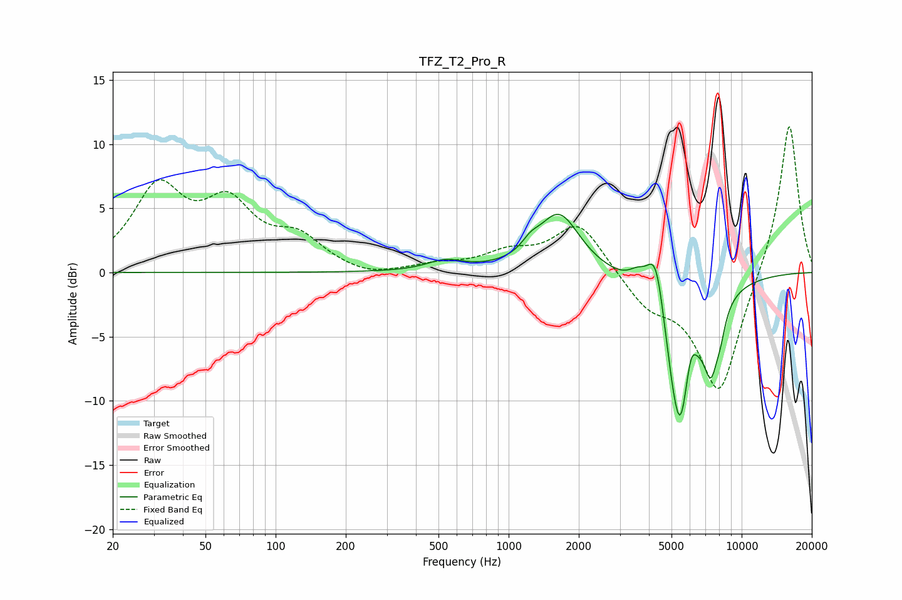

# TFZ_T2_Pro_R
See [usage instructions](https://github.com/jaakkopasanen/AutoEq#usage) for more options and info.

### Parametric EQs
Apply preamp of -4.6 dB when using parametric equalizer.

|   # | Type    |   Fc (Hz) |    Q |   Gain (dB) |
|-----|---------|-----------|------|-------------|
|   1 | Peaking |       534 | 1.84 |         0.8 |
|   2 | Peaking |      1239 | 3.91 |         0.7 |
|   3 | Peaking |      1645 | 1.58 |         4.6 |
|   4 | Peaking |      3565 | 3.68 |         0.9 |
|   5 | Peaking |      4304 | 3.28 |         5.8 |
|   6 | Peaking |      5308 | 1.98 |       -11.5 |
|   7 | Peaking |      5478 | 6    |        -1.8 |
|   8 | Peaking |      6057 | 6    |         2.1 |
|   9 | Peaking |      7386 | 4.22 |        -4.7 |
|  10 | Peaking |      8115 | 6    |        -1.3 |

### Fixed Band EQs
When using fixed band (also called graphic) equalizer, apply preamp of **-11.5 dB** (if available) and set gains manually with these parameters.

|   # | Type    |   Fc (Hz) |    Q |   Gain (dB) |
|-----|---------|-----------|------|-------------|
|   1 | Peaking |        31 | 1.41 |         6.2 |
|   2 | Peaking |        62 | 1.41 |         4.7 |
|   3 | Peaking |       125 | 1.41 |         2.3 |
|   4 | Peaking |       250 | 1.41 |        -0.5 |
|   5 | Peaking |       500 | 1.41 |         0.5 |
|   6 | Peaking |      1000 | 1.41 |         1.3 |
|   7 | Peaking |      2000 | 1.41 |         3.9 |
|   8 | Peaking |      4000 | 1.41 |        -2.3 |
|   9 | Peaking |      8000 | 1.41 |        -9.6 |
|  10 | Peaking |     16000 | 1.41 |        12   |

### Graphs

