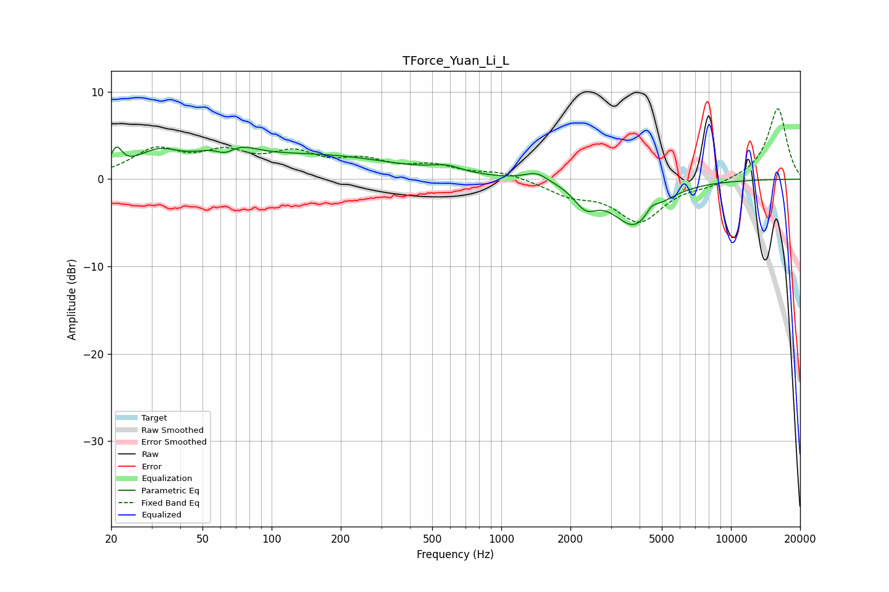

# TForce_Yuan_Li_L
See [usage instructions](https://github.com/jaakkopasanen/AutoEq#usage) for more options and info.

### Parametric EQs
Apply preamp of -3.8 dB when using parametric equalizer.

|   # | Type    |   Fc (Hz) |    Q |   Gain (dB) |
|-----|---------|-----------|------|-------------|
|   1 | Peaking |        21 | 5.94 |         2.3 |
|   2 | Peaking |        32 | 1.44 |         2.5 |
|   3 | Peaking |        63 | 2.95 |        -2   |
|   4 | Peaking |        64 | 1.52 |         3.2 |
|   5 | Peaking |       162 | 0.41 |         2.5 |
|   6 | Peaking |       576 | 2.17 |         0.8 |
|   7 | Peaking |      1424 | 2.84 |         1   |
|   8 | Peaking |      2328 | 2.9  |        -2.2 |
|   9 | Peaking |      3816 | 1.44 |        -5.2 |
|  10 | Peaking |      4518 | 5.12 |         1   |

### Fixed Band EQs
When using fixed band (also called graphic) equalizer, apply preamp of **-8.2 dB** (if available) and set gains manually with these parameters.

|   # | Type    |   Fc (Hz) |    Q |   Gain (dB) |
|-----|---------|-----------|------|-------------|
|   1 | Peaking |        31 | 1.41 |         3.1 |
|   2 | Peaking |        62 | 1.41 |         2.5 |
|   3 | Peaking |       125 | 1.41 |         2.5 |
|   4 | Peaking |       250 | 1.41 |         1.8 |
|   5 | Peaking |       500 | 1.41 |         1.3 |
|   6 | Peaking |      1000 | 1.41 |         0.8 |
|   7 | Peaking |      2000 | 1.41 |        -1.6 |
|   8 | Peaking |      4000 | 1.41 |        -4.7 |
|   9 | Peaking |      8000 | 1.41 |        -0.6 |
|  10 | Peaking |     16000 | 1.41 |         8.2 |

### Graphs

