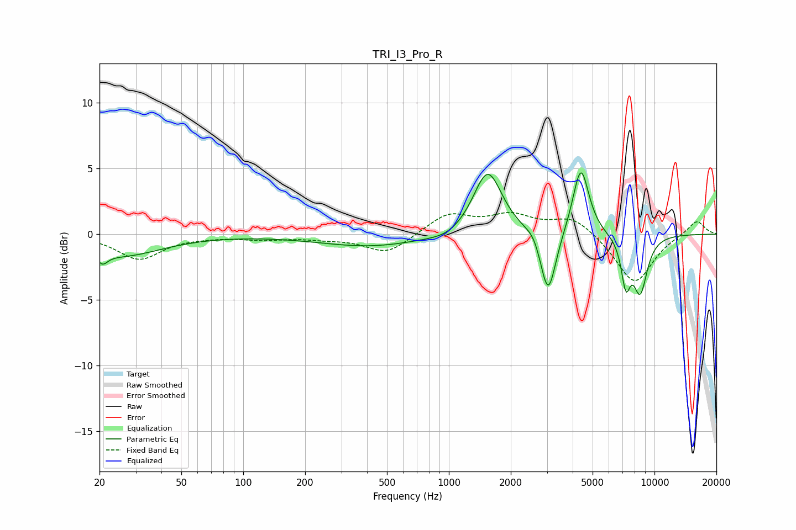

# TRI_I3_Pro_R
See [usage instructions](https://github.com/jaakkopasanen/AutoEq#usage) for more options and info.

### Parametric EQs
Apply preamp of -4.8 dB when using parametric equalizer.

|   # | Type    |   Fc (Hz) |    Q |   Gain (dB) |
|-----|---------|-----------|------|-------------|
|   1 | Peaking |        21 | 5.65 |        -0.8 |
|   2 | Peaking |        25 | 0.71 |        -1.6 |
|   3 | Peaking |       416 | 0.56 |        -0.9 |
|   4 | Peaking |       983 | 1.74 |        -0.4 |
|   5 | Peaking |      1544 | 2.04 |         5   |
|   6 | Peaking |      2596 | 4.17 |         0.5 |
|   7 | Peaking |      3039 | 3.72 |        -5.1 |
|   8 | Peaking |      4385 | 3.58 |         5.2 |
|   9 | Peaking |      7255 | 6    |        -3.3 |
|  10 | Peaking |      8521 | 3.66 |        -4.2 |

### Fixed Band EQs
When using fixed band (also called graphic) equalizer, apply preamp of **-1.8 dB** (if available) and set gains manually with these parameters.

|   # | Type    |   Fc (Hz) |    Q |   Gain (dB) |
|-----|---------|-----------|------|-------------|
|   1 | Peaking |        31 | 1.41 |        -1.9 |
|   2 | Peaking |        62 | 1.41 |        -0.1 |
|   3 | Peaking |       125 | 1.41 |        -0.3 |
|   4 | Peaking |       250 | 1.41 |        -0.3 |
|   5 | Peaking |       500 | 1.41 |        -1.5 |
|   6 | Peaking |      1000 | 1.41 |         1.5 |
|   7 | Peaking |      2000 | 1.41 |         1.3 |
|   8 | Peaking |      4000 | 1.41 |         1.3 |
|   9 | Peaking |      8000 | 1.41 |        -3.8 |
|  10 | Peaking |     16000 | 1.41 |         1.1 |

### Graphs

