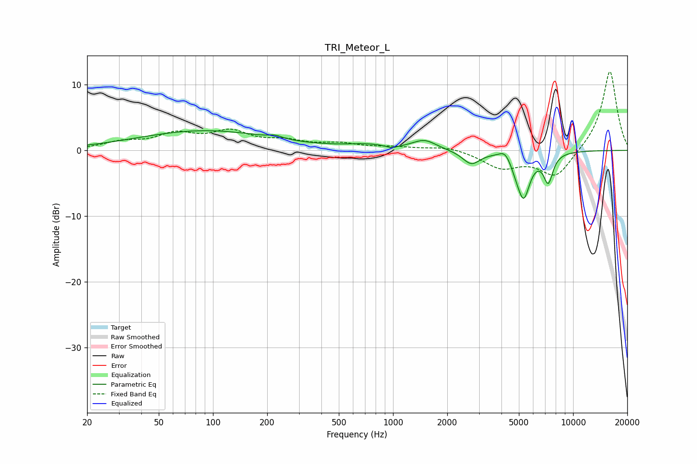

# TRI_Meteor_L
See [usage instructions](https://github.com/jaakkopasanen/AutoEq#usage) for more options and info.

### Parametric EQs
Apply preamp of -3.1 dB when using parametric equalizer.

|   # | Type    |   Fc (Hz) |    Q |   Gain (dB) |
|-----|---------|-----------|------|-------------|
|   1 | Peaking |        90 | 0.38 |         3   |
|   2 | Peaking |       222 | 4    |         0.4 |
|   3 | Peaking |       721 | 1.11 |         0.7 |
|   4 | Peaking |       985 | 4.44 |        -0.4 |
|   5 | Peaking |      1496 | 2.19 |         1.5 |
|   6 | Peaking |      2721 | 2.9  |        -2   |
|   7 | Peaking |      4181 | 4.5  |         1.2 |
|   8 | Peaking |      4791 | 6    |        -0.8 |
|   9 | Peaking |      5304 | 3.84 |        -6.9 |
|  10 | Peaking |      7278 | 5.19 |        -4.2 |

### Fixed Band EQs
When using fixed band (also called graphic) equalizer, apply preamp of **-12.1 dB** (if available) and set gains manually with these parameters.

|   # | Type    |   Fc (Hz) |    Q |   Gain (dB) |
|-----|---------|-----------|------|-------------|
|   1 | Peaking |        31 | 1.41 |         1.1 |
|   2 | Peaking |        62 | 1.41 |         2.2 |
|   3 | Peaking |       125 | 1.41 |         2.5 |
|   4 | Peaking |       250 | 1.41 |         1.2 |
|   5 | Peaking |       500 | 1.41 |         0.9 |
|   6 | Peaking |      1000 | 1.41 |         0.4 |
|   7 | Peaking |      2000 | 1.41 |         0.6 |
|   8 | Peaking |      4000 | 1.41 |        -2.5 |
|   9 | Peaking |      8000 | 1.41 |        -4.2 |
|  10 | Peaking |     16000 | 1.41 |        12.3 |

### Graphs

