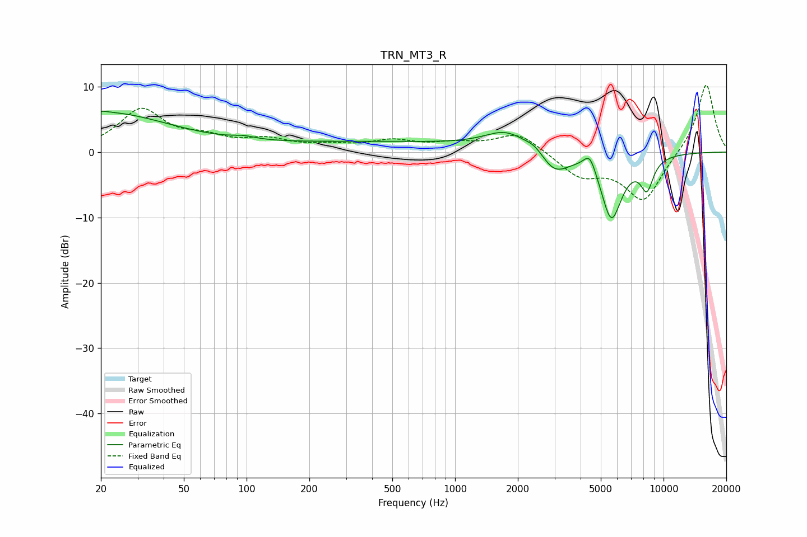

# TRN_MT3_R
See [usage instructions](https://github.com/jaakkopasanen/AutoEq#usage) for more options and info.

### Parametric EQs
Apply preamp of -6.3 dB when using parametric equalizer.

|   # | Type    |   Fc (Hz) |    Q |   Gain (dB) |
|-----|---------|-----------|------|-------------|
|   1 | Peaking |        20 | 0.41 |         6   |
|   2 | Peaking |        21 | 5.88 |         0.2 |
|   3 | Peaking |        97 | 2.52 |         0.5 |
|   4 | Peaking |       412 | 0.25 |         1.5 |
|   5 | Peaking |      1763 | 1.37 |         2.7 |
|   6 | Peaking |      2410 | 3.45 |         0.9 |
|   7 | Peaking |      3005 | 2.1  |        -3.2 |
|   8 | Peaking |      4436 | 4.48 |         3   |
|   9 | Peaking |      5622 | 2.6  |       -10.2 |
|  10 | Peaking |      8321 | 4.22 |        -4.6 |

### Fixed Band EQs
When using fixed band (also called graphic) equalizer, apply preamp of **-10.3 dB** (if available) and set gains manually with these parameters.

|   # | Type    |   Fc (Hz) |    Q |   Gain (dB) |
|-----|---------|-----------|------|-------------|
|   1 | Peaking |        31 | 1.41 |         6.3 |
|   2 | Peaking |        62 | 1.41 |         1.7 |
|   3 | Peaking |       125 | 1.41 |         1.6 |
|   4 | Peaking |       250 | 1.41 |         0.8 |
|   5 | Peaking |       500 | 1.41 |         1.5 |
|   6 | Peaking |      1000 | 1.41 |         1.1 |
|   7 | Peaking |      2000 | 1.41 |         3   |
|   8 | Peaking |      4000 | 1.41 |        -3.5 |
|   9 | Peaking |      8000 | 1.41 |        -7.5 |
|  10 | Peaking |     16000 | 1.41 |        10.7 |

### Graphs

