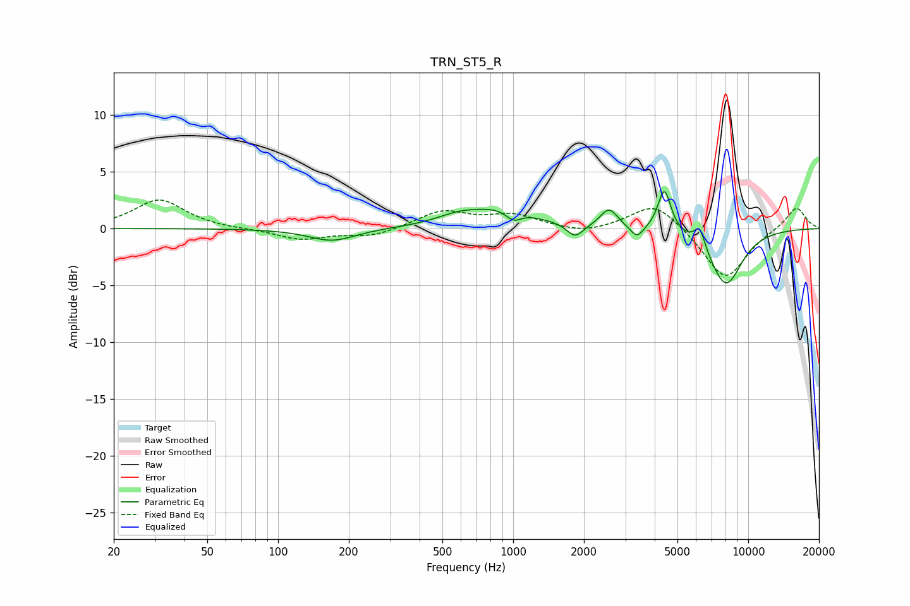

# TRN_ST5_R
See [usage instructions](https://github.com/jaakkopasanen/AutoEq#usage) for more options and info.

### Parametric EQs
Apply preamp of -3.3 dB when using parametric equalizer.

|   # | Type    |   Fc (Hz) |    Q |   Gain (dB) |
|-----|---------|-----------|------|-------------|
|   1 | Peaking |       170 | 1.42 |        -1.1 |
|   2 | Peaking |       577 | 1.62 |         0.6 |
|   3 | Peaking |       883 | 0.96 |         1.7 |
|   4 | Peaking |      1004 | 4.22 |        -0.9 |
|   5 | Peaking |      1834 | 4.02 |        -1.2 |
|   6 | Peaking |      2558 | 3.9  |         1.7 |
|   7 | Peaking |      3365 | 5.14 |        -1.1 |
|   8 | Peaking |      4399 | 5.15 |         3.8 |
|   9 | Peaking |      6215 | 6    |         1.8 |
|  10 | Peaking |      8037 | 1.87 |        -5   |

### Fixed Band EQs
When using fixed band (also called graphic) equalizer, apply preamp of **-2.6 dB** (if available) and set gains manually with these parameters.

|   # | Type    |   Fc (Hz) |    Q |   Gain (dB) |
|-----|---------|-----------|------|-------------|
|   1 | Peaking |        31 | 1.41 |         2.5 |
|   2 | Peaking |        62 | 1.41 |        -0.1 |
|   3 | Peaking |       125 | 1.41 |        -1   |
|   4 | Peaking |       250 | 1.41 |        -0.7 |
|   5 | Peaking |       500 | 1.41 |         1.5 |
|   6 | Peaking |      1000 | 1.41 |         1.1 |
|   7 | Peaking |      2000 | 1.41 |        -0.5 |
|   8 | Peaking |      4000 | 1.41 |         2.4 |
|   9 | Peaking |      8000 | 1.41 |        -4.5 |
|  10 | Peaking |     16000 | 1.41 |         2   |

### Graphs

