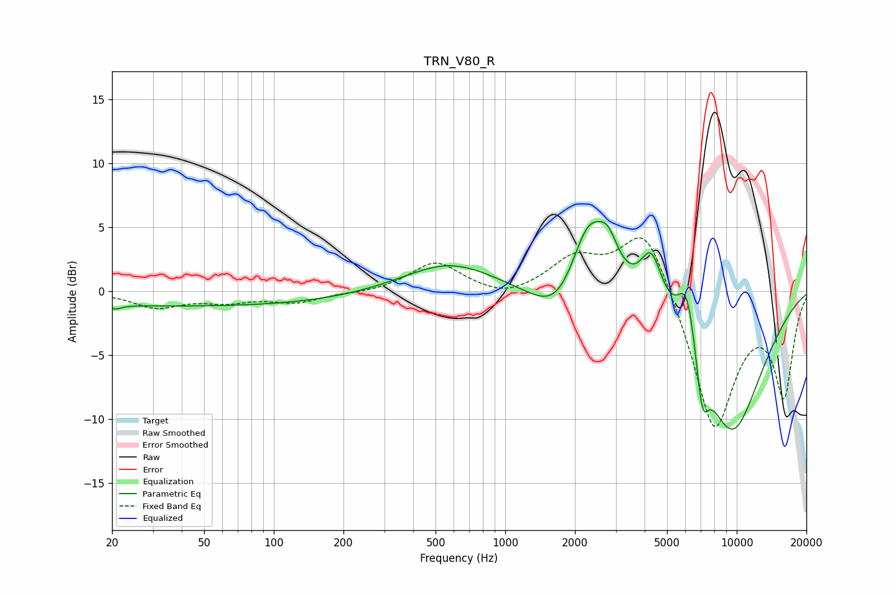

# TRN_V80_R
See [usage instructions](https://github.com/jaakkopasanen/AutoEq#usage) for more options and info.

### Parametric EQs
Apply preamp of -5.5 dB when using parametric equalizer.

|   # | Type    |   Fc (Hz) |    Q |   Gain (dB) |
|-----|---------|-----------|------|-------------|
|   1 | Peaking |        21 | 4.99 |        -0.3 |
|   2 | Peaking |        47 | 0.18 |        -1.2 |
|   3 | Peaking |       572 | 0.72 |         2.3 |
|   4 | Peaking |      1740 | 1.22 |        -3.6 |
|   5 | Peaking |      2284 | 1.65 |         6.9 |
|   6 | Peaking |      2787 | 3.32 |         2.2 |
|   7 | Peaking |      4276 | 2.92 |         4.2 |
|   8 | Peaking |      6093 | 3.26 |         4.9 |
|   9 | Peaking |      7096 | 5.08 |        -4.1 |
|  10 | Peaking |      9503 | 0.84 |       -11.1 |

### Fixed Band EQs
When using fixed band (also called graphic) equalizer, apply preamp of **-4.3 dB** (if available) and set gains manually with these parameters.

|   # | Type    |   Fc (Hz) |    Q |   Gain (dB) |
|-----|---------|-----------|------|-------------|
|   1 | Peaking |        31 | 1.41 |        -1.2 |
|   2 | Peaking |        62 | 1.41 |        -0.7 |
|   3 | Peaking |       125 | 1.41 |        -0.8 |
|   4 | Peaking |       250 | 1.41 |        -0.2 |
|   5 | Peaking |       500 | 1.41 |         2.3 |
|   6 | Peaking |      1000 | 1.41 |        -0.7 |
|   7 | Peaking |      2000 | 1.41 |         2.4 |
|   8 | Peaking |      4000 | 1.41 |         5.5 |
|   9 | Peaking |      8000 | 1.41 |       -11   |
|  10 | Peaking |     16000 | 1.41 |        -7.8 |

### Graphs

