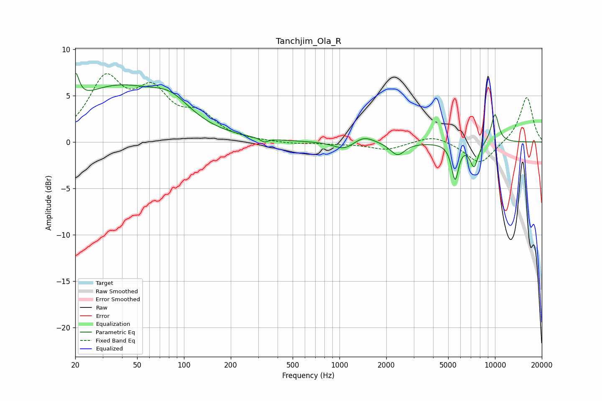

# Tanchjim_Ola_R
See [usage instructions](https://github.com/jaakkopasanen/AutoEq#usage) for more options and info.

### Parametric EQs
Apply preamp of -7.5 dB when using parametric equalizer.

|   # | Type    |   Fc (Hz) |    Q |   Gain (dB) |
|-----|---------|-----------|------|-------------|
|   1 | Peaking |        20 | 5.97 |         3.1 |
|   2 | Peaking |        36 | 0.46 |         5.7 |
|   3 | Peaking |        82 | 1.14 |         2.1 |
|   4 | Peaking |       328 | 5.94 |        -0.4 |
|   5 | Peaking |      1075 | 2.13 |        -0.9 |
|   6 | Peaking |      1434 | 2.18 |         0.8 |
|   7 | Peaking |      2362 | 3.02 |        -1.4 |
|   8 | Peaking |      5538 | 6    |        -3.9 |
|   9 | Peaking |      7339 | 4.97 |        -2.6 |
|  10 | Peaking |     10000 | 4.94 |         3.2 |

### Fixed Band EQs
When using fixed band (also called graphic) equalizer, apply preamp of **-7.5 dB** (if available) and set gains manually with these parameters.

|   # | Type    |   Fc (Hz) |    Q |   Gain (dB) |
|-----|---------|-----------|------|-------------|
|   1 | Peaking |        31 | 1.41 |         6.4 |
|   2 | Peaking |        62 | 1.41 |         4.7 |
|   3 | Peaking |       125 | 1.41 |         2.5 |
|   4 | Peaking |       250 | 1.41 |         0   |
|   5 | Peaking |       500 | 1.41 |        -0.2 |
|   6 | Peaking |      1000 | 1.41 |        -0.2 |
|   7 | Peaking |      2000 | 1.41 |        -0.8 |
|   8 | Peaking |      4000 | 1.41 |         0.8 |
|   9 | Peaking |      8000 | 1.41 |        -2.5 |
|  10 | Peaking |     16000 | 1.41 |         4.9 |

### Graphs

