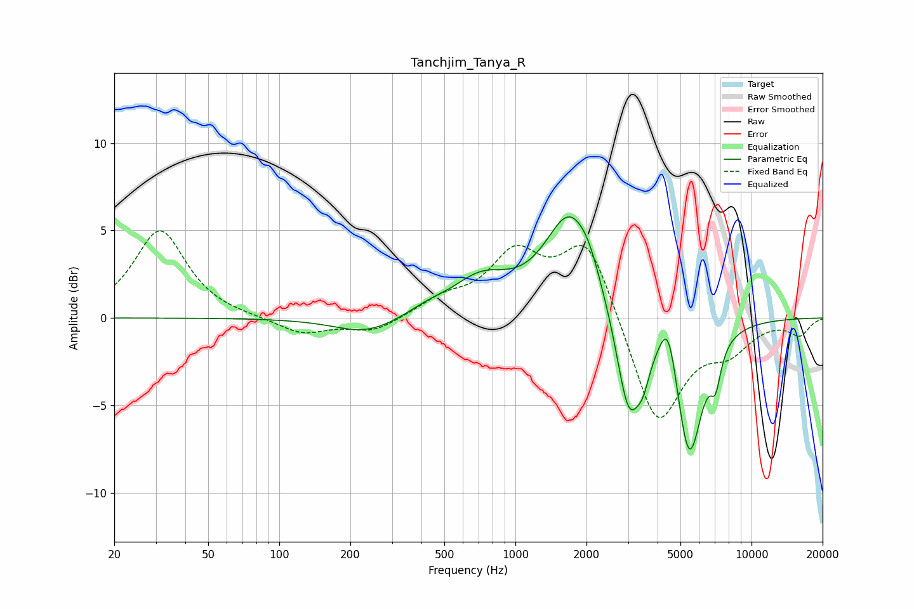

# Tanchjim_Tanya_R
See [usage instructions](https://github.com/jaakkopasanen/AutoEq#usage) for more options and info.

### Parametric EQs
Apply preamp of -5.9 dB when using parametric equalizer.

|   # | Type    |   Fc (Hz) |    Q |   Gain (dB) |
|-----|---------|-----------|------|-------------|
|   1 | Peaking |       234 | 1.05 |        -1   |
|   2 | Peaking |       427 | 1.72 |         0.4 |
|   3 | Peaking |       714 | 1.15 |         2   |
|   4 | Peaking |      1707 | 1.33 |         5.8 |
|   5 | Peaking |      2054 | 3.15 |         0.7 |
|   6 | Peaking |      3016 | 2.69 |        -5.9 |
|   7 | Peaking |      3475 | 4.69 |        -1.5 |
|   8 | Peaking |      4439 | 3.86 |         2.8 |
|   9 | Peaking |      5446 | 2.49 |        -7.9 |
|  10 | Peaking |      7044 | 6    |        -2   |

### Fixed Band EQs
When using fixed band (also called graphic) equalizer, apply preamp of **-5.1 dB** (if available) and set gains manually with these parameters.

|   # | Type    |   Fc (Hz) |    Q |   Gain (dB) |
|-----|---------|-----------|------|-------------|
|   1 | Peaking |        31 | 1.41 |         5   |
|   2 | Peaking |        62 | 1.41 |        -0   |
|   3 | Peaking |       125 | 1.41 |        -0.9 |
|   4 | Peaking |       250 | 1.41 |        -0.8 |
|   5 | Peaking |       500 | 1.41 |         0.9 |
|   6 | Peaking |      1000 | 1.41 |         3.4 |
|   7 | Peaking |      2000 | 1.41 |         4.5 |
|   8 | Peaking |      4000 | 1.41 |        -6.3 |
|   9 | Peaking |      8000 | 1.41 |        -1.6 |
|  10 | Peaking |     16000 | 1.41 |        -0.9 |

### Graphs

