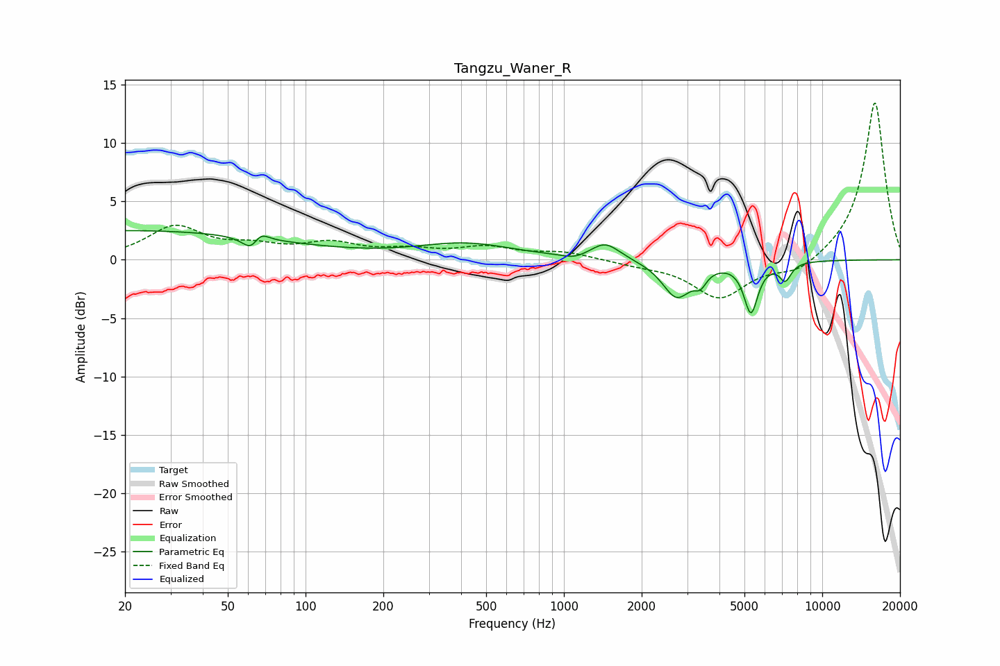

# Tangzu_Waner_R
See [usage instructions](https://github.com/jaakkopasanen/AutoEq#usage) for more options and info.

### Parametric EQs
Apply preamp of -2.6 dB when using parametric equalizer.

|   # | Type    |   Fc (Hz) |    Q |   Gain (dB) |
|-----|---------|-----------|------|-------------|
|   1 | Peaking |        20 | 0.21 |         2.5 |
|   2 | Peaking |        63 | 4.11 |        -1.8 |
|   3 | Peaking |        66 | 4.48 |         1.5 |
|   4 | Peaking |       416 | 0.75 |         1.3 |
|   5 | Peaking |      1100 | 3    |        -0.4 |
|   6 | Peaking |      1447 | 2.53 |         1.4 |
|   7 | Peaking |      2733 | 2.55 |        -3.2 |
|   8 | Peaking |      3375 | 5.99 |        -1.1 |
|   9 | Peaking |      5297 | 5.16 |        -4.3 |
|  10 | Peaking |      7196 | 6    |        -1.5 |

### Fixed Band EQs
When using fixed band (also called graphic) equalizer, apply preamp of **-13.5 dB** (if available) and set gains manually with these parameters.

|   # | Type    |   Fc (Hz) |    Q |   Gain (dB) |
|-----|---------|-----------|------|-------------|
|   1 | Peaking |        31 | 1.41 |         2.7 |
|   2 | Peaking |        62 | 1.41 |         0.9 |
|   3 | Peaking |       125 | 1.41 |         1.2 |
|   4 | Peaking |       250 | 1.41 |         0.7 |
|   5 | Peaking |       500 | 1.41 |         1   |
|   6 | Peaking |      1000 | 1.41 |         0.6 |
|   7 | Peaking |      2000 | 1.41 |        -0.3 |
|   8 | Peaking |      4000 | 1.41 |        -3.2 |
|   9 | Peaking |      8000 | 1.41 |        -1.2 |
|  10 | Peaking |     16000 | 1.41 |        13.6 |

### Graphs

