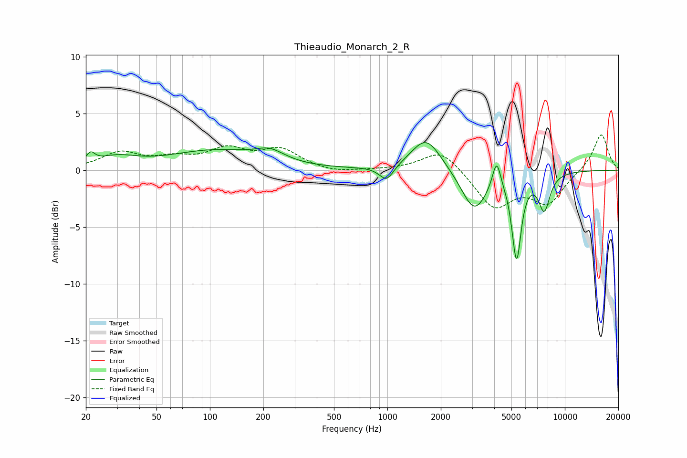

# Thieaudio_Monarch_2_R
See [usage instructions](https://github.com/jaakkopasanen/AutoEq#usage) for more options and info.

### Parametric EQs
Apply preamp of -2.5 dB when using parametric equalizer.

|   # | Type    |   Fc (Hz) |    Q |   Gain (dB) |
|-----|---------|-----------|------|-------------|
|   1 | Peaking |        21 | 6    |         0.8 |
|   2 | Peaking |        30 | 1.21 |         0.9 |
|   3 | Peaking |       105 | 0.56 |         1.6 |
|   4 | Peaking |       218 | 1.7  |         1   |
|   5 | Peaking |       989 | 3.53 |        -1.4 |
|   6 | Peaking |      1655 | 1.67 |         3   |
|   7 | Peaking |      3083 | 1.96 |        -3.6 |
|   8 | Peaking |      4124 | 6    |         2.5 |
|   9 | Peaking |      5342 | 5.34 |        -7.4 |
|  10 | Peaking |      7653 | 4.16 |        -3.2 |

### Fixed Band EQs
When using fixed band (also called graphic) equalizer, apply preamp of **-3.2 dB** (if available) and set gains manually with these parameters.

|   # | Type    |   Fc (Hz) |    Q |   Gain (dB) |
|-----|---------|-----------|------|-------------|
|   1 | Peaking |        31 | 1.41 |         1.5 |
|   2 | Peaking |        62 | 1.41 |         0.8 |
|   3 | Peaking |       125 | 1.41 |         1.6 |
|   4 | Peaking |       250 | 1.41 |         1.7 |
|   5 | Peaking |       500 | 1.41 |        -0.3 |
|   6 | Peaking |      1000 | 1.41 |         0   |
|   7 | Peaking |      2000 | 1.41 |         1.9 |
|   8 | Peaking |      4000 | 1.41 |        -3.3 |
|   9 | Peaking |      8000 | 1.41 |        -2.8 |
|  10 | Peaking |     16000 | 1.41 |         3.3 |

### Graphs

