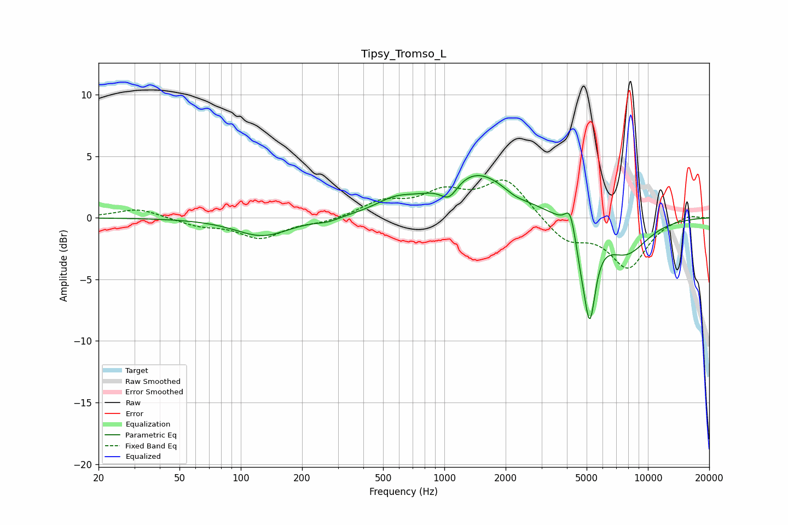

# Tipsy_Tromso_L
See [usage instructions](https://github.com/jaakkopasanen/AutoEq#usage) for more options and info.

### Parametric EQs
Apply preamp of -3.5 dB when using parametric equalizer.

|   # | Type    |   Fc (Hz) |    Q |   Gain (dB) |
|-----|---------|-----------|------|-------------|
|   1 | Peaking |       128 | 1.07 |        -1.5 |
|   2 | Peaking |       269 | 2.52 |        -0.3 |
|   3 | Peaking |       570 | 1.47 |         0.9 |
|   4 | Peaking |      1056 | 3.3  |        -1.4 |
|   5 | Peaking |      1424 | 0.8  |         3.8 |
|   6 | Peaking |      2220 | 2.49 |        -0.4 |
|   7 | Peaking |      4144 | 5.92 |         1.8 |
|   8 | Peaking |      4672 | 6    |        -1.3 |
|   9 | Peaking |      5174 | 4.76 |        -7.2 |
|  10 | Peaking |      7787 | 1.19 |        -2.8 |

### Fixed Band EQs
When using fixed band (also called graphic) equalizer, apply preamp of **-3.2 dB** (if available) and set gains manually with these parameters.

|   # | Type    |   Fc (Hz) |    Q |   Gain (dB) |
|-----|---------|-----------|------|-------------|
|   1 | Peaking |        31 | 1.41 |         0.8 |
|   2 | Peaking |        62 | 1.41 |        -0.6 |
|   3 | Peaking |       125 | 1.41 |        -1.6 |
|   4 | Peaking |       250 | 1.41 |        -0.3 |
|   5 | Peaking |       500 | 1.41 |         1.2 |
|   6 | Peaking |      1000 | 1.41 |         1.8 |
|   7 | Peaking |      2000 | 1.41 |         3.1 |
|   8 | Peaking |      4000 | 1.41 |        -1.9 |
|   9 | Peaking |      8000 | 1.41 |        -3.9 |
|  10 | Peaking |     16000 | 1.41 |         0.3 |

### Graphs

