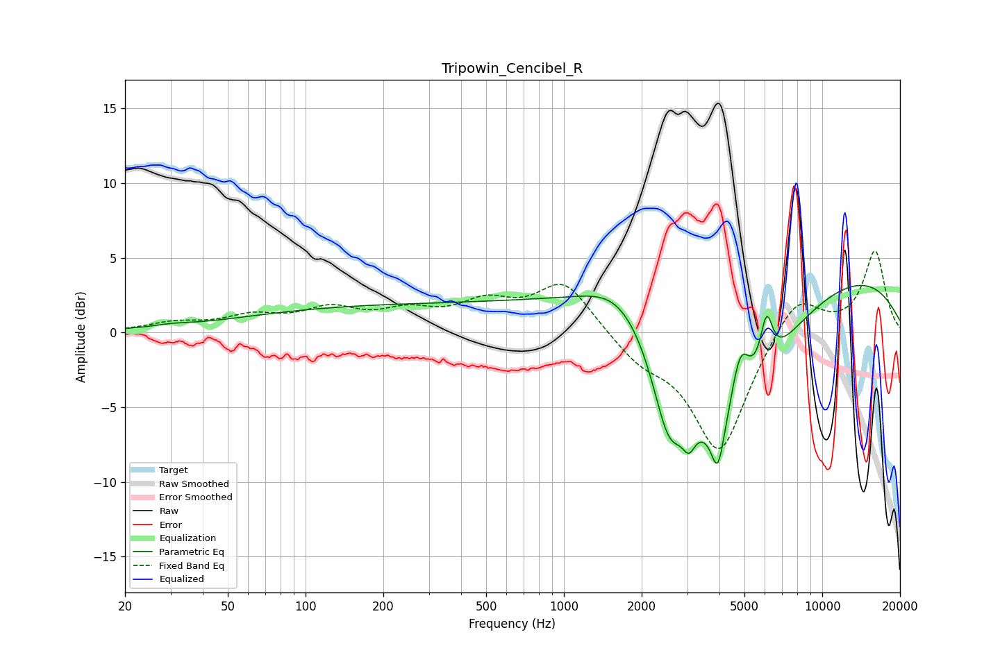

# Tripowin_Cencibel_R
See [usage instructions](https://github.com/jaakkopasanen/AutoEq#usage) for more options and info.

### Parametric EQs
Apply preamp of -3.2 dB when using parametric equalizer.

|   # | Type    |   Fc (Hz) |    Q |   Gain (dB) |
|-----|---------|-----------|------|-------------|
|   1 | Peaking |        30 | 2.13 |         0.2 |
|   2 | Peaking |       291 | 0.18 |         1.8 |
|   3 | Peaking |      1647 | 1.12 |         2.1 |
|   4 | Peaking |      2545 | 2.31 |        -5.3 |
|   5 | Peaking |      3049 | 5.78 |        -1.6 |
|   6 | Peaking |      3942 | 5.86 |        -3.1 |
|   7 | Peaking |      4177 | 0.7  |       -11.5 |
|   8 | Peaking |      4813 | 3.65 |         4.3 |
|   9 | Peaking |      6088 | 5.84 |         3.3 |
|  10 | Peaking |      6931 | 0.18 |         5.2 |

### Fixed Band EQs
When using fixed band (also called graphic) equalizer, apply preamp of **-5.5 dB** (if available) and set gains manually with these parameters.

|   # | Type    |   Fc (Hz) |    Q |   Gain (dB) |
|-----|---------|-----------|------|-------------|
|   1 | Peaking |        31 | 1.41 |         0.6 |
|   2 | Peaking |        62 | 1.41 |         0.9 |
|   3 | Peaking |       125 | 1.41 |         1.4 |
|   4 | Peaking |       250 | 1.41 |         1.2 |
|   5 | Peaking |       500 | 1.41 |         1.7 |
|   6 | Peaking |      1000 | 1.41 |         3.4 |
|   7 | Peaking |      2000 | 1.41 |        -1.6 |
|   8 | Peaking |      4000 | 1.41 |        -8.1 |
|   9 | Peaking |      8000 | 1.41 |         2.8 |
|  10 | Peaking |     16000 | 1.41 |         5.4 |

### Graphs

