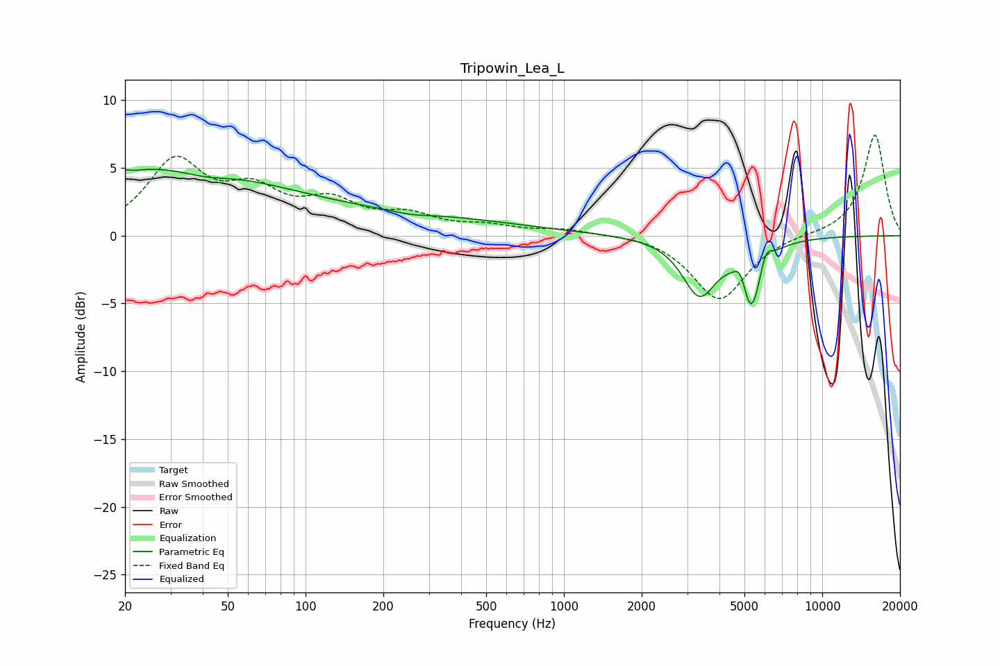

# Tripowin_Lea_L
See [usage instructions](https://github.com/jaakkopasanen/AutoEq#usage) for more options and info.

### Parametric EQs
Apply preamp of -5.0 dB when using parametric equalizer.

|   # | Type    |   Fc (Hz) |    Q |   Gain (dB) |
|-----|---------|-----------|------|-------------|
|   1 | Peaking |        20 | 5.21 |         3.7 |
|   2 | Peaking |        20 | 0.27 |         4.7 |
|   3 | Peaking |        20 | 4.89 |        -3.8 |
|   4 | Peaking |        41 | 1.49 |        -0.5 |
|   5 | Peaking |       161 | 0.23 |         1.5 |
|   6 | Peaking |       257 | 2.15 |        -0.2 |
|   7 | Peaking |      3344 | 2.14 |        -4.2 |
|   8 | Peaking |      4858 | 5.23 |         2   |
|   9 | Peaking |      5272 | 3.31 |        -5.7 |
|  10 | Peaking |      6034 | 5.81 |         1.5 |

### Fixed Band EQs
When using fixed band (also called graphic) equalizer, apply preamp of **-7.5 dB** (if available) and set gains manually with these parameters.

|   # | Type    |   Fc (Hz) |    Q |   Gain (dB) |
|-----|---------|-----------|------|-------------|
|   1 | Peaking |        31 | 1.41 |         5.2 |
|   2 | Peaking |        62 | 1.41 |         2.8 |
|   3 | Peaking |       125 | 1.41 |         2.1 |
|   4 | Peaking |       250 | 1.41 |         1.3 |
|   5 | Peaking |       500 | 1.41 |         0.6 |
|   6 | Peaking |      1000 | 1.41 |         0.4 |
|   7 | Peaking |      2000 | 1.41 |         0.2 |
|   8 | Peaking |      4000 | 1.41 |        -4.8 |
|   9 | Peaking |      8000 | 1.41 |         0.1 |
|  10 | Peaking |     16000 | 1.41 |         7.5 |

### Graphs

