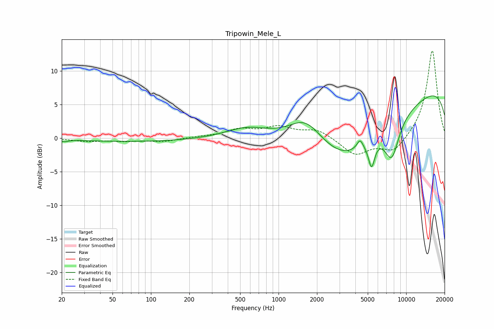

# Tripowin_Mele_L
See [usage instructions](https://github.com/jaakkopasanen/AutoEq#usage) for more options and info.

### Parametric EQs
Apply preamp of -6.4 dB when using parametric equalizer.

|   # | Type    |   Fc (Hz) |    Q |   Gain (dB) |
|-----|---------|-----------|------|-------------|
|   1 | Peaking |        21 | 5.24 |        -0.3 |
|   2 | Peaking |        75 | 0.3  |        -0.5 |
|   3 | Peaking |       563 | 0.89 |         1.5 |
|   4 | Peaking |      1633 | 1.11 |         3.5 |
|   5 | Peaking |      3297 | 0.66 |        -4.6 |
|   6 | Peaking |      4349 | 6    |         1.4 |
|   7 | Peaking |      5355 | 5.54 |        -3.8 |
|   8 | Peaking |      5933 | 0.26 |        -6.3 |
|   9 | Peaking |      7701 | 2.23 |        -5.7 |
|  10 | Peaking |     10000 | 0.18 |        10.7 |

### Fixed Band EQs
When using fixed band (also called graphic) equalizer, apply preamp of **-13.1 dB** (if available) and set gains manually with these parameters.

|   # | Type    |   Fc (Hz) |    Q |   Gain (dB) |
|-----|---------|-----------|------|-------------|
|   1 | Peaking |        31 | 1.41 |        -0.5 |
|   2 | Peaking |        62 | 1.41 |        -0.4 |
|   3 | Peaking |       125 | 1.41 |        -0.5 |
|   4 | Peaking |       250 | 1.41 |         0.2 |
|   5 | Peaking |       500 | 1.41 |         1.2 |
|   6 | Peaking |      1000 | 1.41 |         1.5 |
|   7 | Peaking |      2000 | 1.41 |         1.3 |
|   8 | Peaking |      4000 | 1.41 |        -2.5 |
|   9 | Peaking |      8000 | 1.41 |        -2.2 |
|  10 | Peaking |     16000 | 1.41 |        13.2 |

### Graphs

