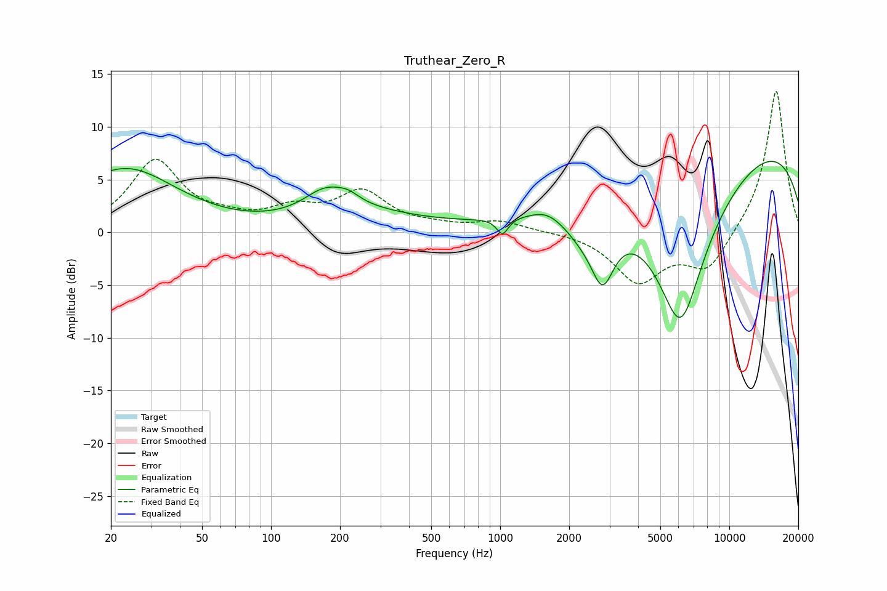

# Truthear_Zero_R
See [usage instructions](https://github.com/jaakkopasanen/AutoEq#usage) for more options and info.

### Parametric EQs
Apply preamp of -6.8 dB when using parametric equalizer.

|   # | Type    |   Fc (Hz) |    Q |   Gain (dB) |
|-----|---------|-----------|------|-------------|
|   1 | Peaking |        23 | 0.63 |         6   |
|   2 | Peaking |       173 | 1.51 |         2.3 |
|   3 | Peaking |       217 | 2.88 |         0.7 |
|   4 | Peaking |       253 | 0.55 |         1.5 |
|   5 | Peaking |      1024 | 5.61 |        -1.6 |
|   6 | Peaking |      1598 | 2.15 |         0.7 |
|   7 | Peaking |      2255 | 1.66 |        -1.8 |
|   8 | Peaking |      2798 | 2.69 |        -5.7 |
|   9 | Peaking |      6124 | 1    |       -16.9 |
|  10 | Peaking |      9531 | 0.19 |         9.7 |

### Fixed Band EQs
When using fixed band (also called graphic) equalizer, apply preamp of **-13.5 dB** (if available) and set gains manually with these parameters.

|   # | Type    |   Fc (Hz) |    Q |   Gain (dB) |
|-----|---------|-----------|------|-------------|
|   1 | Peaking |        31 | 1.41 |         6.7 |
|   2 | Peaking |        62 | 1.41 |         0.8 |
|   3 | Peaking |       125 | 1.41 |         1.9 |
|   4 | Peaking |       250 | 1.41 |         3.6 |
|   5 | Peaking |       500 | 1.41 |         0.4 |
|   6 | Peaking |      1000 | 1.41 |         1   |
|   7 | Peaking |      2000 | 1.41 |         0.1 |
|   8 | Peaking |      4000 | 1.41 |        -4.6 |
|   9 | Peaking |      8000 | 1.41 |        -3.6 |
|  10 | Peaking |     16000 | 1.41 |        13.7 |

### Graphs

