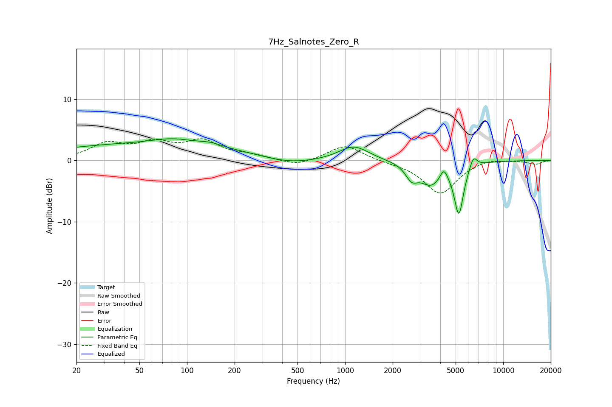

# 7Hz_Salnotes_Zero_R
See [usage instructions](https://github.com/jaakkopasanen/AutoEq#usage) for more options and info.

### Parametric EQs
Apply preamp of -3.6 dB when using parametric equalizer.

|   # | Type    |   Fc (Hz) |    Q |   Gain (dB) |
|-----|---------|-----------|------|-------------|
|   1 | Peaking |        56 | 0.21 |         2.6 |
|   2 | Peaking |        82 | 1.08 |         0.9 |
|   3 | Peaking |       141 | 2.08 |         0.5 |
|   4 | Peaking |       441 | 0.85 |        -1   |
|   5 | Peaking |      1135 | 1.51 |         2.4 |
|   6 | Peaking |      2635 | 3.64 |        -2.2 |
|   7 | Peaking |      3494 | 1.96 |        -3.6 |
|   8 | Peaking |      4213 | 6    |         1.9 |
|   9 | Peaking |      5243 | 4.72 |        -8.2 |
|  10 | Peaking |      6477 | 5.86 |         2   |

### Fixed Band EQs
When using fixed band (also called graphic) equalizer, apply preamp of **-3.6 dB** (if available) and set gains manually with these parameters.

|   # | Type    |   Fc (Hz) |    Q |   Gain (dB) |
|-----|---------|-----------|------|-------------|
|   1 | Peaking |        31 | 1.41 |         2.5 |
|   2 | Peaking |        62 | 1.41 |         2.5 |
|   3 | Peaking |       125 | 1.41 |         2.9 |
|   4 | Peaking |       250 | 1.41 |         0.7 |
|   5 | Peaking |       500 | 1.41 |        -1   |
|   6 | Peaking |      1000 | 1.41 |         2.6 |
|   7 | Peaking |      2000 | 1.41 |        -0.2 |
|   8 | Peaking |      4000 | 1.41 |        -5.5 |
|   9 | Peaking |      8000 | 1.41 |         0.5 |
|  10 | Peaking |     16000 | 1.41 |        -0.6 |

### Graphs

