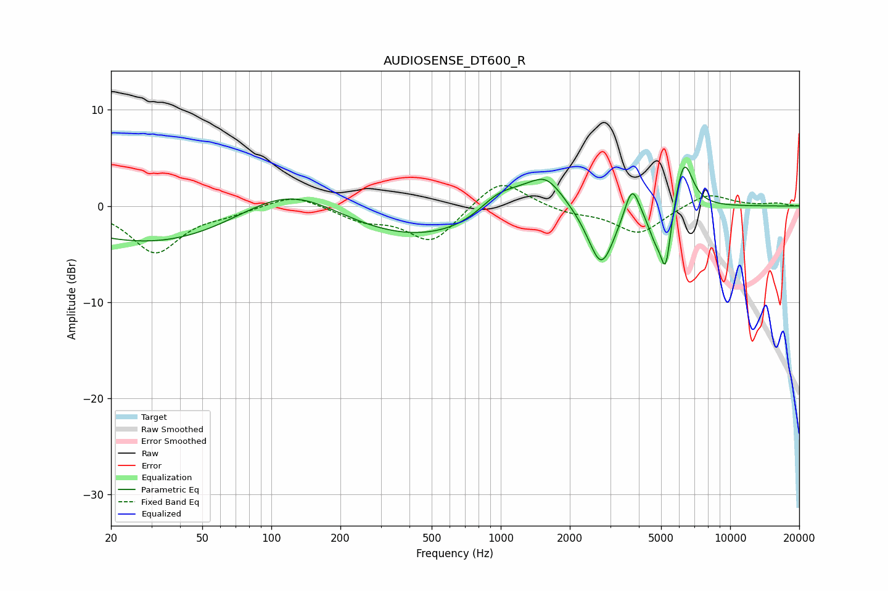

# AUDIOSENSE_DT600_R
See [usage instructions](https://github.com/jaakkopasanen/AutoEq#usage) for more options and info.

### Parametric EQs
Apply preamp of -4.2 dB when using parametric equalizer.

|   # | Type    |   Fc (Hz) |    Q |   Gain (dB) |
|-----|---------|-----------|------|-------------|
|   1 | Peaking |       116 | 0.18 |       -12.3 |
|   2 | Peaking |       120 | 0.37 |        13   |
|   3 | Peaking |       986 | 1.5  |         2.5 |
|   4 | Peaking |      1431 | 3.03 |        -0.5 |
|   5 | Peaking |      1522 | 1.61 |         4.4 |
|   6 | Peaking |      2743 | 2.43 |        -6.4 |
|   7 | Peaking |      3734 | 4.46 |         3.5 |
|   8 | Peaking |      4711 | 4.16 |        -2.6 |
|   9 | Peaking |      5238 | 6    |        -6.2 |
|  10 | Peaking |      6290 | 3.54 |         5.3 |

### Fixed Band EQs
When using fixed band (also called graphic) equalizer, apply preamp of **-2.2 dB** (if available) and set gains manually with these parameters.

|   # | Type    |   Fc (Hz) |    Q |   Gain (dB) |
|-----|---------|-----------|------|-------------|
|   1 | Peaking |        31 | 1.41 |        -4.8 |
|   2 | Peaking |        62 | 1.41 |        -0.6 |
|   3 | Peaking |       125 | 1.41 |         1.3 |
|   4 | Peaking |       250 | 1.41 |        -1.3 |
|   5 | Peaking |       500 | 1.41 |        -3.8 |
|   6 | Peaking |      1000 | 1.41 |         3   |
|   7 | Peaking |      2000 | 1.41 |        -0.7 |
|   8 | Peaking |      4000 | 1.41 |        -2.9 |
|   9 | Peaking |      8000 | 1.41 |         1.4 |
|  10 | Peaking |     16000 | 1.41 |         0.3 |

### Graphs

