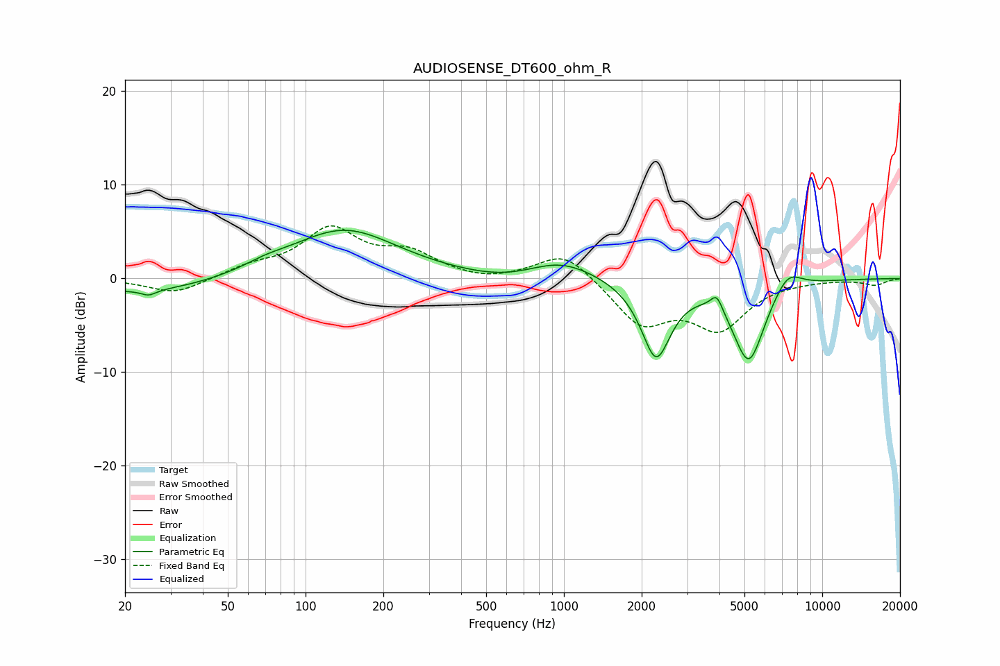

# AUDIOSENSE_DT600_ohm_R
See [usage instructions](https://github.com/jaakkopasanen/AutoEq#usage) for more options and info.

### Parametric EQs
Apply preamp of -5.2 dB when using parametric equalizer.

|   # | Type    |   Fc (Hz) |    Q |   Gain (dB) |
|-----|---------|-----------|------|-------------|
|   1 | Peaking |        24 | 0.51 |        -1.6 |
|   2 | Peaking |        25 | 5.07 |        -0.6 |
|   3 | Peaking |        70 | 1.68 |         0.6 |
|   4 | Peaking |       140 | 0.68 |         5.3 |
|   5 | Peaking |       596 | 0.96 |        -0.7 |
|   6 | Peaking |       975 | 1.06 |         2   |
|   7 | Peaking |      2273 | 2.42 |        -8.3 |
|   8 | Peaking |      3907 | 5.98 |         1.8 |
|   9 | Peaking |      5199 | 2.21 |        -8.8 |
|  10 | Peaking |      7348 | 2.48 |         2.2 |

### Fixed Band EQs
When using fixed band (also called graphic) equalizer, apply preamp of **-5.7 dB** (if available) and set gains manually with these parameters.

|   # | Type    |   Fc (Hz) |    Q |   Gain (dB) |
|-----|---------|-----------|------|-------------|
|   1 | Peaking |        31 | 1.41 |        -1.7 |
|   2 | Peaking |        62 | 1.41 |         1.1 |
|   3 | Peaking |       125 | 1.41 |         5   |
|   4 | Peaking |       250 | 1.41 |         2.4 |
|   5 | Peaking |       500 | 1.41 |        -0.5 |
|   6 | Peaking |      1000 | 1.41 |         3   |
|   7 | Peaking |      2000 | 1.41 |        -4.7 |
|   8 | Peaking |      4000 | 1.41 |        -5   |
|   9 | Peaking |      8000 | 1.41 |        -0.1 |
|  10 | Peaking |     16000 | 1.41 |        -0.7 |

### Graphs

