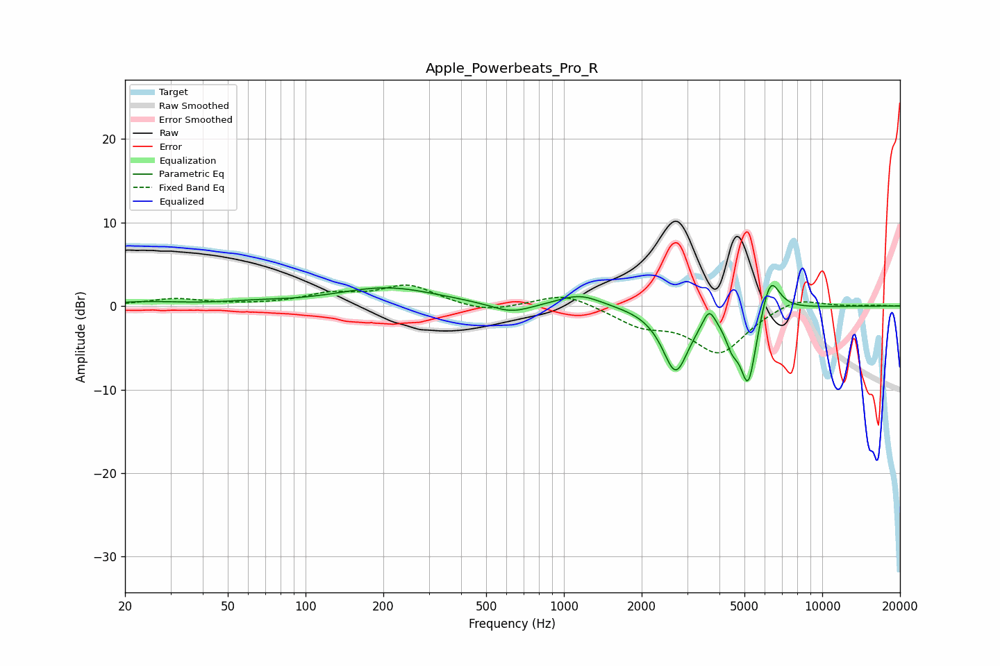

# Apple_Powerbeats_Pro_R
See [usage instructions](https://github.com/jaakkopasanen/AutoEq#usage) for more options and info.

### Parametric EQs
Apply preamp of -2.5 dB when using parametric equalizer.

|   # | Type    |   Fc (Hz) |    Q |   Gain (dB) |
|-----|---------|-----------|------|-------------|
|   1 | Peaking |        24 | 1.12 |         0.4 |
|   2 | Peaking |        62 | 1.12 |         0.3 |
|   3 | Peaking |       207 | 0.72 |         2.2 |
|   4 | Peaking |       625 | 1.82 |        -1.2 |
|   5 | Peaking |      1152 | 1.66 |         1.5 |
|   6 | Peaking |      2707 | 2.75 |        -7.7 |
|   7 | Peaking |      3645 | 6    |         2.1 |
|   8 | Peaking |      4474 | 5.5  |        -2.4 |
|   9 | Peaking |      5172 | 4.24 |        -9.2 |
|  10 | Peaking |      6288 | 3.8  |         4.8 |

### Fixed Band EQs
When using fixed band (also called graphic) equalizer, apply preamp of **-2.6 dB** (if available) and set gains manually with these parameters.

|   # | Type    |   Fc (Hz) |    Q |   Gain (dB) |
|-----|---------|-----------|------|-------------|
|   1 | Peaking |        31 | 1.41 |         0.8 |
|   2 | Peaking |        62 | 1.41 |         0.1 |
|   3 | Peaking |       125 | 1.41 |         1.3 |
|   4 | Peaking |       250 | 1.41 |         2.4 |
|   5 | Peaking |       500 | 1.41 |        -0.8 |
|   6 | Peaking |      1000 | 1.41 |         1.6 |
|   7 | Peaking |      2000 | 1.41 |        -2   |
|   8 | Peaking |      4000 | 1.41 |        -5.5 |
|   9 | Peaking |      8000 | 1.41 |         1.2 |
|  10 | Peaking |     16000 | 1.41 |         0.1 |

### Graphs

