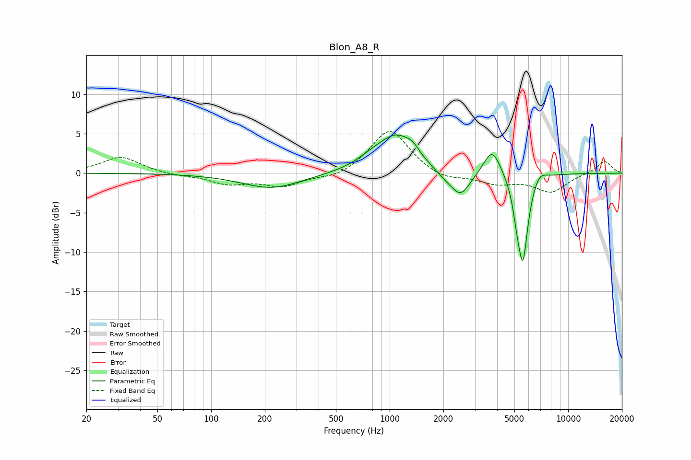

# Blon_A8_R
See [usage instructions](https://github.com/jaakkopasanen/AutoEq#usage) for more options and info.

### Parametric EQs
Apply preamp of -4.9 dB when using parametric equalizer.

|   # | Type    |   Fc (Hz) |    Q |   Gain (dB) |
|-----|---------|-----------|------|-------------|
|   1 | Peaking |       218 | 0.85 |        -1.9 |
|   2 | Peaking |       781 | 1.68 |         0.8 |
|   3 | Peaking |      1102 | 1.31 |         4.7 |
|   4 | Peaking |      1346 | 4.59 |         0.7 |
|   5 | Peaking |      2006 | 2.17 |        -0.8 |
|   6 | Peaking |      2496 | 2.55 |        -3.1 |
|   7 | Peaking |      3753 | 2.96 |         3.5 |
|   8 | Peaking |      5160 | 6    |        -2.5 |
|   9 | Peaking |      5581 | 4.83 |       -10.6 |
|  10 | Peaking |      6914 | 3.83 |         1.1 |

### Fixed Band EQs
When using fixed band (also called graphic) equalizer, apply preamp of **-5.4 dB** (if available) and set gains manually with these parameters.

|   # | Type    |   Fc (Hz) |    Q |   Gain (dB) |
|-----|---------|-----------|------|-------------|
|   1 | Peaking |        31 | 1.41 |         2.1 |
|   2 | Peaking |        62 | 1.41 |        -0.3 |
|   3 | Peaking |       125 | 1.41 |        -1.3 |
|   4 | Peaking |       250 | 1.41 |        -1.6 |
|   5 | Peaking |       500 | 1.41 |        -0.7 |
|   6 | Peaking |      1000 | 1.41 |         5.7 |
|   7 | Peaking |      2000 | 1.41 |        -1   |
|   8 | Peaking |      4000 | 1.41 |        -1.2 |
|   9 | Peaking |      8000 | 1.41 |        -2.3 |
|  10 | Peaking |     16000 | 1.41 |         1.6 |

### Graphs

