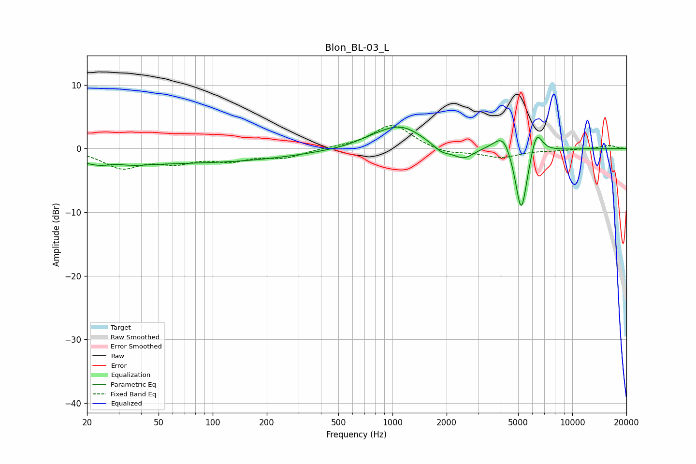

# Blon_BL-03_L
See [usage instructions](https://github.com/jaakkopasanen/AutoEq#usage) for more options and info.

### Parametric EQs
Apply preamp of -3.5 dB when using parametric equalizer.

|   # | Type    |   Fc (Hz) |    Q |   Gain (dB) |
|-----|---------|-----------|------|-------------|
|   1 | Peaking |        26 | 1.01 |        -2.1 |
|   2 | Peaking |        29 | 2.17 |         0.9 |
|   3 | Peaking |        87 | 0.27 |        -2.1 |
|   4 | Peaking |       784 | 1.37 |         0.7 |
|   5 | Peaking |      1113 | 1.14 |         3.4 |
|   6 | Peaking |      1875 | 2.79 |        -1.3 |
|   7 | Peaking |      2484 | 2.5  |        -1.8 |
|   8 | Peaking |      4148 | 2.69 |         3.4 |
|   9 | Peaking |      5204 | 3.91 |       -11.2 |
|  10 | Peaking |      6303 | 4.11 |         4.3 |

### Fixed Band EQs
When using fixed band (also called graphic) equalizer, apply preamp of **-3.7 dB** (if available) and set gains manually with these parameters.

|   # | Type    |   Fc (Hz) |    Q |   Gain (dB) |
|-----|---------|-----------|------|-------------|
|   1 | Peaking |        31 | 1.41 |        -2.8 |
|   2 | Peaking |        62 | 1.41 |        -1.8 |
|   3 | Peaking |       125 | 1.41 |        -1.6 |
|   4 | Peaking |       250 | 1.41 |        -1.3 |
|   5 | Peaking |       500 | 1.41 |         0.2 |
|   6 | Peaking |      1000 | 1.41 |         3.9 |
|   7 | Peaking |      2000 | 1.41 |        -0.9 |
|   8 | Peaking |      4000 | 1.41 |        -1.4 |
|   9 | Peaking |      8000 | 1.41 |        -0.2 |
|  10 | Peaking |     16000 | 1.41 |         0.5 |

### Graphs

