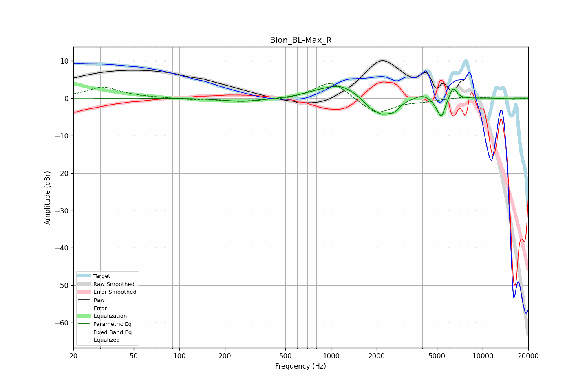

# Blon_BL-Max_R
See [usage instructions](https://github.com/jaakkopasanen/AutoEq#usage) for more options and info.

### Parametric EQs
Apply preamp of -3.2 dB when using parametric equalizer.

|   # | Type    |   Fc (Hz) |    Q |   Gain (dB) |
|-----|---------|-----------|------|-------------|
|   1 | Peaking |       267 | 1.11 |        -1   |
|   2 | Peaking |       797 | 1.85 |         0.7 |
|   3 | Peaking |      1140 | 1.33 |         3.5 |
|   4 | Peaking |      1786 | 3.3  |        -1.2 |
|   5 | Peaking |      2178 | 2.06 |        -4.3 |
|   6 | Peaking |      2620 | 4.26 |        -1.5 |
|   7 | Peaking |      4011 | 2.72 |         1.3 |
|   8 | Peaking |      5004 | 4.35 |        -1.3 |
|   9 | Peaking |      5357 | 6    |        -4.5 |
|  10 | Peaking |      6395 | 5.95 |         3.2 |

### Fixed Band EQs
When using fixed band (also called graphic) equalizer, apply preamp of **-3.9 dB** (if available) and set gains manually with these parameters.

|   # | Type    |   Fc (Hz) |    Q |   Gain (dB) |
|-----|---------|-----------|------|-------------|
|   1 | Peaking |        31 | 1.41 |         2.9 |
|   2 | Peaking |        62 | 1.41 |         0.1 |
|   3 | Peaking |       125 | 1.41 |        -0.4 |
|   4 | Peaking |       250 | 1.41 |        -0.9 |
|   5 | Peaking |       500 | 1.41 |        -0.5 |
|   6 | Peaking |      1000 | 1.41 |         4.8 |
|   7 | Peaking |      2000 | 1.41 |        -4.4 |
|   8 | Peaking |      4000 | 1.41 |        -0.7 |
|   9 | Peaking |      8000 | 1.41 |         0.5 |
|  10 | Peaking |     16000 | 1.41 |        -0.3 |

### Graphs

