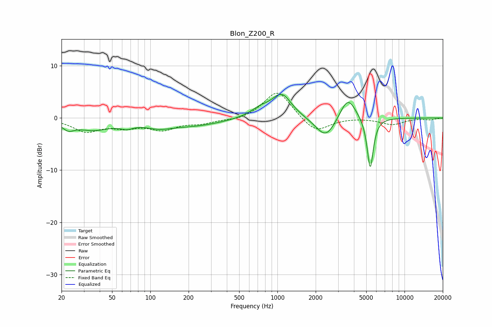

# Blon_Z200_R
See [usage instructions](https://github.com/jaakkopasanen/AutoEq#usage) for more options and info.

### Parametric EQs
Apply preamp of -4.6 dB when using parametric equalizer.

|   # | Type    |   Fc (Hz) |    Q |   Gain (dB) |
|-----|---------|-----------|------|-------------|
|   1 | Peaking |        23 | 2.99 |        -1.4 |
|   2 | Peaking |        36 | 1.06 |        -2   |
|   3 | Peaking |        65 | 2.64 |        -0.9 |
|   4 | Peaking |       117 | 1.28 |        -1.2 |
|   5 | Peaking |       224 | 0.63 |        -1.3 |
|   6 | Peaking |       731 | 1.76 |         1.4 |
|   7 | Peaking |      1081 | 1.82 |         4.5 |
|   8 | Peaking |      2403 | 1.79 |        -4.2 |
|   9 | Peaking |      3577 | 2.25 |         4.5 |
|  10 | Peaking |      5370 | 5.71 |       -10.1 |

### Fixed Band EQs
When using fixed band (also called graphic) equalizer, apply preamp of **-4.8 dB** (if available) and set gains manually with these parameters.

|   # | Type    |   Fc (Hz) |    Q |   Gain (dB) |
|-----|---------|-----------|------|-------------|
|   1 | Peaking |        31 | 1.41 |        -2.4 |
|   2 | Peaking |        62 | 1.41 |        -1.5 |
|   3 | Peaking |       125 | 1.41 |        -2   |
|   4 | Peaking |       250 | 1.41 |        -0.9 |
|   5 | Peaking |       500 | 1.41 |        -0.5 |
|   6 | Peaking |      1000 | 1.41 |         5.4 |
|   7 | Peaking |      2000 | 1.41 |        -3   |
|   8 | Peaking |      4000 | 1.41 |         0.1 |
|   9 | Peaking |      8000 | 1.41 |        -1.2 |
|  10 | Peaking |     16000 | 1.41 |        -0.3 |

### Graphs

