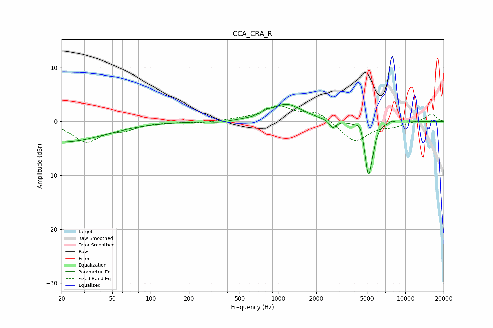

# CCA_CRA_R
See [usage instructions](https://github.com/jaakkopasanen/AutoEq#usage) for more options and info.

### Parametric EQs
Apply preamp of -3.3 dB when using parametric equalizer.

|   # | Type    |   Fc (Hz) |    Q |   Gain (dB) |
|-----|---------|-----------|------|-------------|
|   1 | Peaking |        20 | 0.43 |        -3.8 |
|   2 | Peaking |       342 | 2.44 |        -0.3 |
|   3 | Peaking |       805 | 5.13 |         0.6 |
|   4 | Peaking |      1162 | 1.16 |         3.2 |
|   5 | Peaking |      2701 | 5.46 |        -1.5 |
|   6 | Peaking |      4400 | 6    |         1.4 |
|   7 | Peaking |      5108 | 4.97 |        -9   |
|   8 | Peaking |      5449 | 6    |        -1.3 |
|   9 | Peaking |      5453 | 6    |        -0.6 |
|  10 | Peaking |      7809 | 5.97 |         0.4 |

### Fixed Band EQs
When using fixed band (also called graphic) equalizer, apply preamp of **-3.0 dB** (if available) and set gains manually with these parameters.

|   # | Type    |   Fc (Hz) |    Q |   Gain (dB) |
|-----|---------|-----------|------|-------------|
|   1 | Peaking |        31 | 1.41 |        -3.7 |
|   2 | Peaking |        62 | 1.41 |        -1.2 |
|   3 | Peaking |       125 | 1.41 |        -0.1 |
|   4 | Peaking |       250 | 1.41 |        -0.3 |
|   5 | Peaking |       500 | 1.41 |         0.3 |
|   6 | Peaking |      1000 | 1.41 |         2.7 |
|   7 | Peaking |      2000 | 1.41 |         1.7 |
|   8 | Peaking |      4000 | 1.41 |        -3.8 |
|   9 | Peaking |      8000 | 1.41 |        -0.8 |
|  10 | Peaking |     16000 | 1.41 |         1.4 |

### Graphs

