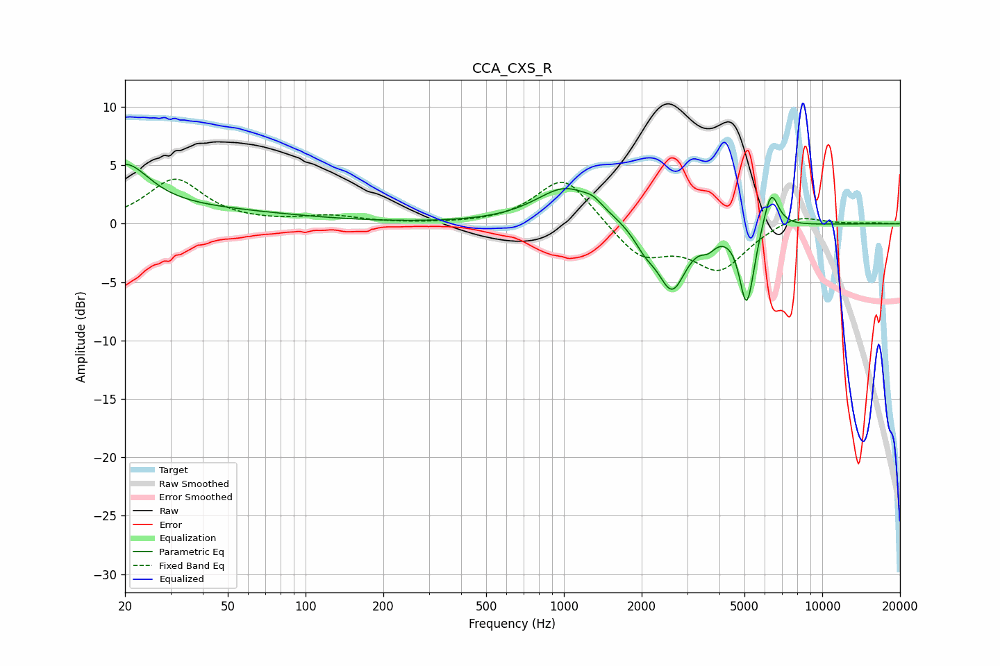

# CCA_CXS_R
See [usage instructions](https://github.com/jaakkopasanen/AutoEq#usage) for more options and info.

### Parametric EQs
Apply preamp of -5.2 dB when using parametric equalizer.

|   # | Type    |   Fc (Hz) |    Q |   Gain (dB) |
|-----|---------|-----------|------|-------------|
|   1 | Peaking |        20 | 1.54 |         3.9 |
|   2 | Peaking |        29 | 0.31 |         1.2 |
|   3 | Peaking |      1020 | 1.22 |         3.1 |
|   4 | Peaking |      1298 | 4.27 |         0.5 |
|   5 | Peaking |      2062 | 3.2  |        -1.4 |
|   6 | Peaking |      2621 | 2.52 |        -5.5 |
|   7 | Peaking |      3617 | 4.89 |        -0.9 |
|   8 | Peaking |      5072 | 5.15 |        -6   |
|   9 | Peaking |      5315 | 5.98 |        -1   |
|  10 | Peaking |      6336 | 4.74 |         3.4 |

### Fixed Band EQs
When using fixed band (also called graphic) equalizer, apply preamp of **-3.9 dB** (if available) and set gains manually with these parameters.

|   # | Type    |   Fc (Hz) |    Q |   Gain (dB) |
|-----|---------|-----------|------|-------------|
|   1 | Peaking |        31 | 1.41 |         3.8 |
|   2 | Peaking |        62 | 1.41 |         0   |
|   3 | Peaking |       125 | 1.41 |         0.6 |
|   4 | Peaking |       250 | 1.41 |        -0   |
|   5 | Peaking |       500 | 1.41 |        -0   |
|   6 | Peaking |      1000 | 1.41 |         4.2 |
|   7 | Peaking |      2000 | 1.41 |        -2.9 |
|   8 | Peaking |      4000 | 1.41 |        -3.8 |
|   9 | Peaking |      8000 | 1.41 |         1   |
|  10 | Peaking |     16000 | 1.41 |         0.1 |

### Graphs

