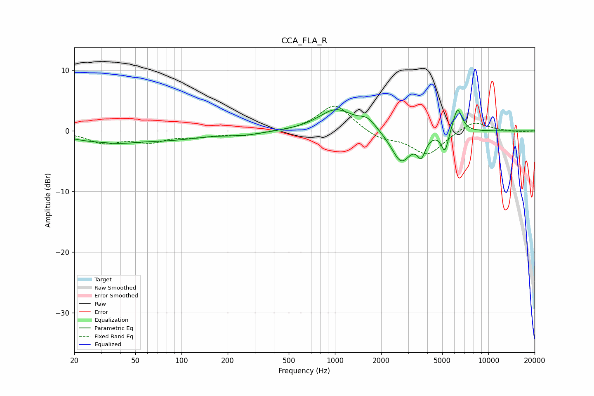

# CCA_FLA_R
See [usage instructions](https://github.com/jaakkopasanen/AutoEq#usage) for more options and info.

### Parametric EQs
Apply preamp of -3.6 dB when using parametric equalizer.

|   # | Type    |   Fc (Hz) |    Q |   Gain (dB) |
|-----|---------|-----------|------|-------------|
|   1 | Peaking |        30 | 1.8  |         0.4 |
|   2 | Peaking |        32 | 0.75 |        -2   |
|   3 | Peaking |        88 | 0.68 |        -1.1 |
|   4 | Peaking |       259 | 1.09 |        -0.5 |
|   5 | Peaking |      1014 | 1.27 |         3.5 |
|   6 | Peaking |      1630 | 2.55 |         1.6 |
|   7 | Peaking |      2700 | 2.19 |        -5.2 |
|   8 | Peaking |      3652 | 5.37 |        -3   |
|   9 | Peaking |      5209 | 6    |        -3.4 |
|  10 | Peaking |      6289 | 4.62 |         4.1 |

### Fixed Band EQs
When using fixed band (also called graphic) equalizer, apply preamp of **-4.2 dB** (if available) and set gains manually with these parameters.

|   # | Type    |   Fc (Hz) |    Q |   Gain (dB) |
|-----|---------|-----------|------|-------------|
|   1 | Peaking |        31 | 1.41 |        -1.8 |
|   2 | Peaking |        62 | 1.41 |        -1.6 |
|   3 | Peaking |       125 | 1.41 |        -0.7 |
|   4 | Peaking |       250 | 1.41 |        -0.7 |
|   5 | Peaking |       500 | 1.41 |        -0.1 |
|   6 | Peaking |      1000 | 1.41 |         4.5 |
|   7 | Peaking |      2000 | 1.41 |        -1.3 |
|   8 | Peaking |      4000 | 1.41 |        -3.9 |
|   9 | Peaking |      8000 | 1.41 |         1.8 |
|  10 | Peaking |     16000 | 1.41 |        -0.2 |

### Graphs

