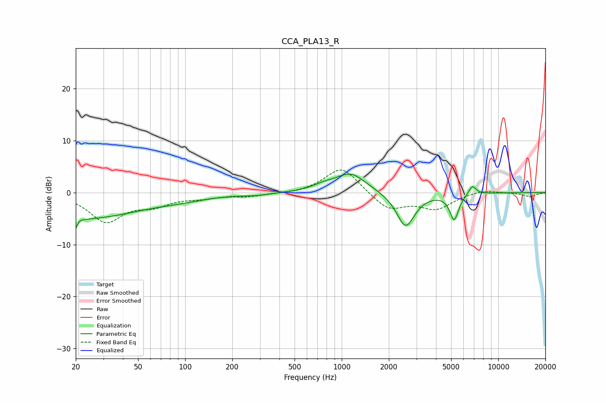

# CCA_PLA13_R
See [usage instructions](https://github.com/jaakkopasanen/AutoEq#usage) for more options and info.

### Parametric EQs
Apply preamp of -3.6 dB when using parametric equalizer.

|   # | Type    |   Fc (Hz) |    Q |   Gain (dB) |
|-----|---------|-----------|------|-------------|
|   1 | Peaking |        20 | 5.47 |        -5.1 |
|   2 | Peaking |        21 | 5.96 |         3.2 |
|   3 | Peaking |        24 | 0.43 |        -4.7 |
|   4 | Peaking |        96 | 0.82 |        -0.7 |
|   5 | Peaking |       281 | 1.59 |        -0.4 |
|   6 | Peaking |       764 | 2.02 |         0.8 |
|   7 | Peaking |      1141 | 1.44 |         3.7 |
|   8 | Peaking |      2561 | 2.41 |        -6.7 |
|   9 | Peaking |      5228 | 4.94 |        -5   |
|  10 | Peaking |      6840 | 5.98 |         1.8 |

### Fixed Band EQs
When using fixed band (also called graphic) equalizer, apply preamp of **-4.4 dB** (if available) and set gains manually with these parameters.

|   # | Type    |   Fc (Hz) |    Q |   Gain (dB) |
|-----|---------|-----------|------|-------------|
|   1 | Peaking |        31 | 1.41 |        -5.4 |
|   2 | Peaking |        62 | 1.41 |        -2   |
|   3 | Peaking |       125 | 1.41 |        -0.8 |
|   4 | Peaking |       250 | 1.41 |        -0.7 |
|   5 | Peaking |       500 | 1.41 |        -0.2 |
|   6 | Peaking |      1000 | 1.41 |         5.1 |
|   7 | Peaking |      2000 | 1.41 |        -3.3 |
|   8 | Peaking |      4000 | 1.41 |        -2.9 |
|   9 | Peaking |      8000 | 1.41 |         0.6 |
|  10 | Peaking |     16000 | 1.41 |        -0.8 |

### Graphs

