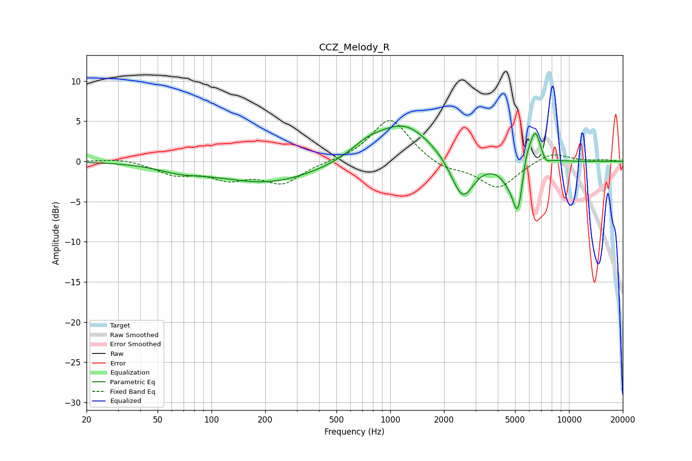

# CCZ_Melody_R
See [usage instructions](https://github.com/jaakkopasanen/AutoEq#usage) for more options and info.

### Parametric EQs
Apply preamp of -4.5 dB when using parametric equalizer.

|   # | Type    |   Fc (Hz) |    Q |   Gain (dB) |
|-----|---------|-----------|------|-------------|
|   1 | Peaking |        67 | 1.18 |        -0.8 |
|   2 | Peaking |       209 | 0.5  |        -2.7 |
|   3 | Peaking |       740 | 1.65 |         1.2 |
|   4 | Peaking |      1191 | 0.88 |         4.8 |
|   5 | Peaking |      2538 | 2.19 |        -5.4 |
|   6 | Peaking |      4511 | 2.99 |        -1.2 |
|   7 | Peaking |      5176 | 4.53 |        -6.4 |
|   8 | Peaking |      5757 | 6    |         1.9 |
|   9 | Peaking |      6462 | 4.24 |         4.4 |
|  10 | Peaking |      7427 | 5.99 |        -0.9 |

### Fixed Band EQs
When using fixed band (also called graphic) equalizer, apply preamp of **-5.2 dB** (if available) and set gains manually with these parameters.

|   # | Type    |   Fc (Hz) |    Q |   Gain (dB) |
|-----|---------|-----------|------|-------------|
|   1 | Peaking |        31 | 1.41 |         0.4 |
|   2 | Peaking |        62 | 1.41 |        -1.5 |
|   3 | Peaking |       125 | 1.41 |        -1.9 |
|   4 | Peaking |       250 | 1.41 |        -2.6 |
|   5 | Peaking |       500 | 1.41 |        -0   |
|   6 | Peaking |      1000 | 1.41 |         5.5 |
|   7 | Peaking |      2000 | 1.41 |        -1.1 |
|   8 | Peaking |      4000 | 1.41 |        -3.4 |
|   9 | Peaking |      8000 | 1.41 |         1.2 |
|  10 | Peaking |     16000 | 1.41 |         0.2 |

### Graphs

