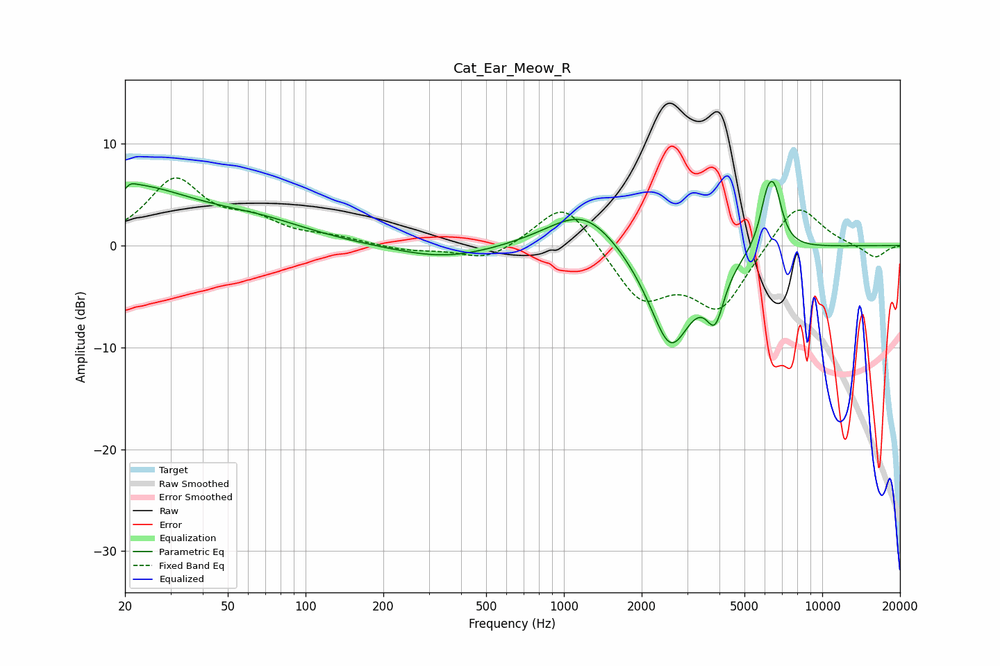

# Cat_Ear_Meow_R
See [usage instructions](https://github.com/jaakkopasanen/AutoEq#usage) for more options and info.

### Parametric EQs
Apply preamp of -6.4 dB when using parametric equalizer.

|   # | Type    |   Fc (Hz) |    Q |   Gain (dB) |
|-----|---------|-----------|------|-------------|
|   1 | Peaking |        20 | 0.54 |         5.7 |
|   2 | Peaking |        20 | 5.98 |        -3.6 |
|   3 | Peaking |        20 | 5.91 |         3.3 |
|   4 | Peaking |        67 | 0.69 |         1.6 |
|   5 | Peaking |       347 | 0.72 |        -1.4 |
|   6 | Peaking |      1202 | 1.01 |         4.1 |
|   7 | Peaking |      2586 | 1.58 |       -10.2 |
|   8 | Peaking |      3852 | 4    |        -4.7 |
|   9 | Peaking |      6134 | 4.49 |         4.3 |
|  10 | Peaking |      6575 | 4.7  |         4   |

### Fixed Band EQs
When using fixed band (also called graphic) equalizer, apply preamp of **-6.7 dB** (if available) and set gains manually with these parameters.

|   # | Type    |   Fc (Hz) |    Q |   Gain (dB) |
|-----|---------|-----------|------|-------------|
|   1 | Peaking |        31 | 1.41 |         6.2 |
|   2 | Peaking |        62 | 1.41 |         2   |
|   3 | Peaking |       125 | 1.41 |         0.6 |
|   4 | Peaking |       250 | 1.41 |        -0.5 |
|   5 | Peaking |       500 | 1.41 |        -1.5 |
|   6 | Peaking |      1000 | 1.41 |         4.7 |
|   7 | Peaking |      2000 | 1.41 |        -5.2 |
|   8 | Peaking |      4000 | 1.41 |        -6.1 |
|   9 | Peaking |      8000 | 1.41 |         4.5 |
|  10 | Peaking |     16000 | 1.41 |        -1.3 |

### Graphs

