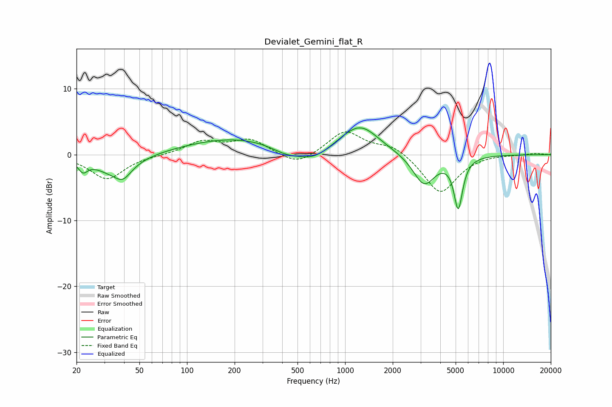

# Devialet_Gemini_flat_R
See [usage instructions](https://github.com/jaakkopasanen/AutoEq#usage) for more options and info.

### Parametric EQs
Apply preamp of -4.2 dB when using parametric equalizer.

|   # | Type    |   Fc (Hz) |    Q |   Gain (dB) |
|-----|---------|-----------|------|-------------|
|   1 | Peaking |        22 | 4.86 |        -1.6 |
|   2 | Peaking |        35 | 1.16 |        -2.7 |
|   3 | Peaking |        39 | 2.96 |        -1.6 |
|   4 | Peaking |       204 | 0.44 |         2.5 |
|   5 | Peaking |       422 | 1.46 |        -1.2 |
|   6 | Peaking |       636 | 1.34 |        -1.9 |
|   7 | Peaking |      1001 | 1.08 |         0.7 |
|   8 | Peaking |      1259 | 1.21 |         3.9 |
|   9 | Peaking |      3158 | 2.02 |        -4.7 |
|  10 | Peaking |      5197 | 5.07 |        -7.6 |

### Fixed Band EQs
When using fixed band (also called graphic) equalizer, apply preamp of **-3.5 dB** (if available) and set gains manually with these parameters.

|   # | Type    |   Fc (Hz) |    Q |   Gain (dB) |
|-----|---------|-----------|------|-------------|
|   1 | Peaking |        31 | 1.41 |        -3.7 |
|   2 | Peaking |        62 | 1.41 |        -0.1 |
|   3 | Peaking |       125 | 1.41 |         1.9 |
|   4 | Peaking |       250 | 1.41 |         2.2 |
|   5 | Peaking |       500 | 1.41 |        -1.8 |
|   6 | Peaking |      1000 | 1.41 |         3.6 |
|   7 | Peaking |      2000 | 1.41 |         1.5 |
|   8 | Peaking |      4000 | 1.41 |        -6   |
|   9 | Peaking |      8000 | 1.41 |         0.1 |
|  10 | Peaking |     16000 | 1.41 |         0.2 |

### Graphs

