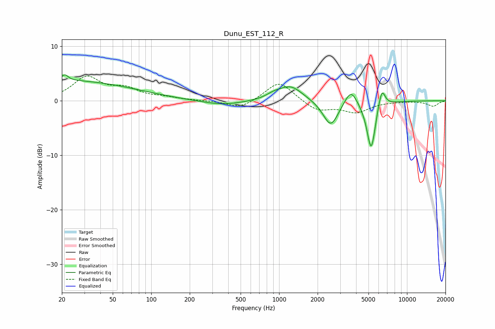

# Dunu_EST_112_R
See [usage instructions](https://github.com/jaakkopasanen/AutoEq#usage) for more options and info.

### Parametric EQs
Apply preamp of -4.8 dB when using parametric equalizer.

|   # | Type    |   Fc (Hz) |    Q |   Gain (dB) |
|-----|---------|-----------|------|-------------|
|   1 | Peaking |        20 | 0.24 |         3.7 |
|   2 | Peaking |        21 | 5.72 |         1.1 |
|   3 | Peaking |       361 | 0.84 |        -0.9 |
|   4 | Peaking |       904 | 2.47 |         0.6 |
|   5 | Peaking |      1227 | 1.49 |         2.8 |
|   6 | Peaking |      2532 | 2.36 |        -4.8 |
|   7 | Peaking |      3641 | 2.96 |         3   |
|   8 | Peaking |      5247 | 3.99 |        -9.2 |
|   9 | Peaking |      6008 | 5.42 |         0.6 |
|  10 | Peaking |      6377 | 5.4  |         3.3 |

### Fixed Band EQs
When using fixed band (also called graphic) equalizer, apply preamp of **-4.6 dB** (if available) and set gains manually with these parameters.

|   # | Type    |   Fc (Hz) |    Q |   Gain (dB) |
|-----|---------|-----------|------|-------------|
|   1 | Peaking |        31 | 1.41 |         4.2 |
|   2 | Peaking |        62 | 1.41 |         1.9 |
|   3 | Peaking |       125 | 1.41 |         0.5 |
|   4 | Peaking |       250 | 1.41 |         0   |
|   5 | Peaking |       500 | 1.41 |        -1.5 |
|   6 | Peaking |      1000 | 1.41 |         3.7 |
|   7 | Peaking |      2000 | 1.41 |        -1.9 |
|   8 | Peaking |      4000 | 1.41 |        -2   |
|   9 | Peaking |      8000 | 1.41 |        -0   |
|  10 | Peaking |     16000 | 1.41 |        -1   |

### Graphs

