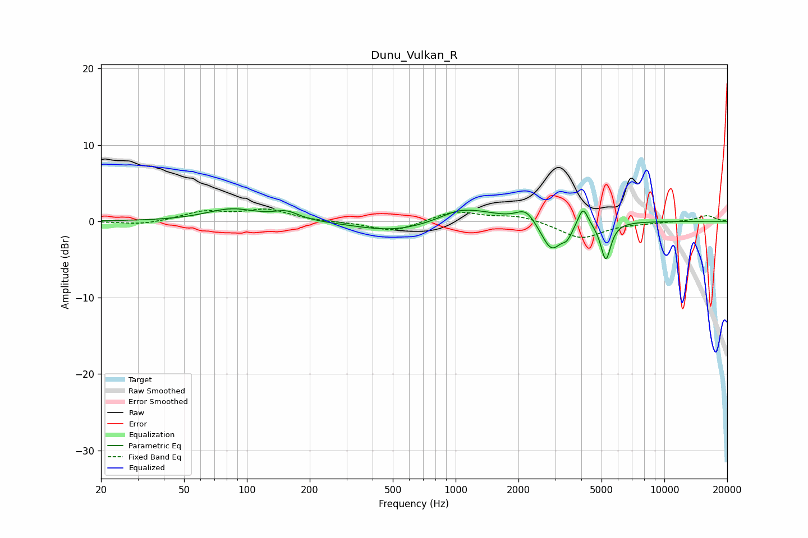

# Dunu_Vulkan_R
See [usage instructions](https://github.com/jaakkopasanen/AutoEq#usage) for more options and info.

### Parametric EQs
Apply preamp of -1.7 dB when using parametric equalizer.

|   # | Type    |   Fc (Hz) |    Q |   Gain (dB) |
|-----|---------|-----------|------|-------------|
|   1 | Peaking |        85 | 1.14 |         1.6 |
|   2 | Peaking |       155 | 2.36 |         1   |
|   3 | Peaking |       515 | 0.76 |        -1.4 |
|   4 | Peaking |      1004 | 1.99 |         0.5 |
|   5 | Peaking |      1167 | 1.02 |         1.6 |
|   6 | Peaking |      2168 | 3.17 |         1.7 |
|   7 | Peaking |      2878 | 2.93 |        -3.9 |
|   8 | Peaking |      3424 | 5.98 |        -1.3 |
|   9 | Peaking |      4077 | 6    |         2.5 |
|  10 | Peaking |      5241 | 5.86 |        -5   |

### Fixed Band EQs
When using fixed band (also called graphic) equalizer, apply preamp of **-1.7 dB** (if available) and set gains manually with these parameters.

|   # | Type    |   Fc (Hz) |    Q |   Gain (dB) |
|-----|---------|-----------|------|-------------|
|   1 | Peaking |        31 | 1.41 |        -0.5 |
|   2 | Peaking |        62 | 1.41 |         1.2 |
|   3 | Peaking |       125 | 1.41 |         1.4 |
|   4 | Peaking |       250 | 1.41 |        -0.1 |
|   5 | Peaking |       500 | 1.41 |        -1.4 |
|   6 | Peaking |      1000 | 1.41 |         1.4 |
|   7 | Peaking |      2000 | 1.41 |         0.8 |
|   8 | Peaking |      4000 | 1.41 |        -2.3 |
|   9 | Peaking |      8000 | 1.41 |        -0.2 |
|  10 | Peaking |     16000 | 1.41 |         0.8 |

### Graphs

