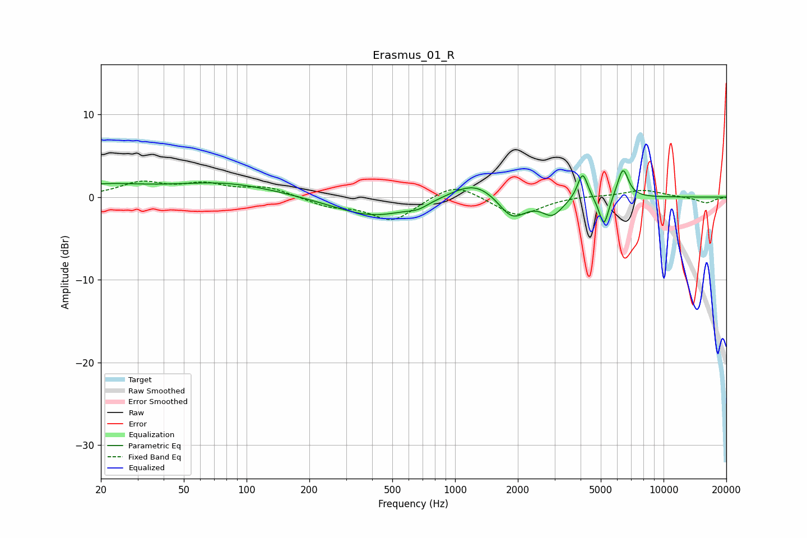

# Erasmus_01_R
See [usage instructions](https://github.com/jaakkopasanen/AutoEq#usage) for more options and info.

### Parametric EQs
Apply preamp of -3.3 dB when using parametric equalizer.

|   # | Type    |   Fc (Hz) |    Q |   Gain (dB) |
|-----|---------|-----------|------|-------------|
|   1 | Peaking |        20 | 0.68 |         1.3 |
|   2 | Peaking |        79 | 0.56 |         1.6 |
|   3 | Peaking |       409 | 0.74 |        -2.4 |
|   4 | Peaking |       664 | 3.03 |        -0.5 |
|   5 | Peaking |      1248 | 1.21 |         2.3 |
|   6 | Peaking |      1876 | 2.12 |        -2.9 |
|   7 | Peaking |      2928 | 2.85 |        -2   |
|   8 | Peaking |      4092 | 5.78 |         3.3 |
|   9 | Peaking |      5176 | 6    |        -3.7 |
|  10 | Peaking |      6386 | 5.23 |         3.6 |

### Fixed Band EQs
When using fixed band (also called graphic) equalizer, apply preamp of **-2.0 dB** (if available) and set gains manually with these parameters.

|   # | Type    |   Fc (Hz) |    Q |   Gain (dB) |
|-----|---------|-----------|------|-------------|
|   1 | Peaking |        31 | 1.41 |         1.6 |
|   2 | Peaking |        62 | 1.41 |         1.4 |
|   3 | Peaking |       125 | 1.41 |         1.1 |
|   4 | Peaking |       250 | 1.41 |        -1   |
|   5 | Peaking |       500 | 1.41 |        -2.8 |
|   6 | Peaking |      1000 | 1.41 |         1.9 |
|   7 | Peaking |      2000 | 1.41 |        -2.4 |
|   8 | Peaking |      4000 | 1.41 |         0.2 |
|   9 | Peaking |      8000 | 1.41 |         0.9 |
|  10 | Peaking |     16000 | 1.41 |        -0.7 |

### Graphs

