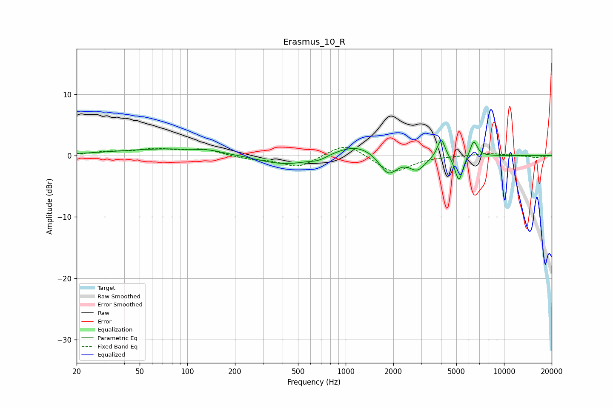

# Erasmus_10_R
See [usage instructions](https://github.com/jaakkopasanen/AutoEq#usage) for more options and info.

### Parametric EQs
Apply preamp of -2.5 dB when using parametric equalizer.

|   # | Type    |   Fc (Hz) |    Q |   Gain (dB) |
|-----|---------|-----------|------|-------------|
|   1 | Peaking |        79 | 0.42 |         1.1 |
|   2 | Peaking |       138 | 2.34 |         0.3 |
|   3 | Peaking |       417 | 0.79 |        -1.7 |
|   4 | Peaking |       676 | 2.75 |        -0.6 |
|   5 | Peaking |      1175 | 1.01 |         2.1 |
|   6 | Peaking |      1857 | 2.47 |        -3.5 |
|   7 | Peaking |      2832 | 2.78 |        -2.2 |
|   8 | Peaking |      4014 | 5.82 |         3.3 |
|   9 | Peaking |      5192 | 5.56 |        -4.3 |
|  10 | Peaking |      6432 | 6    |         2.7 |

### Fixed Band EQs
When using fixed band (also called graphic) equalizer, apply preamp of **-1.4 dB** (if available) and set gains manually with these parameters.

|   # | Type    |   Fc (Hz) |    Q |   Gain (dB) |
|-----|---------|-----------|------|-------------|
|   1 | Peaking |        31 | 1.41 |         0.5 |
|   2 | Peaking |        62 | 1.41 |         0.9 |
|   3 | Peaking |       125 | 1.41 |         1   |
|   4 | Peaking |       250 | 1.41 |        -0.5 |
|   5 | Peaking |       500 | 1.41 |        -1.9 |
|   6 | Peaking |      1000 | 1.41 |         2.2 |
|   7 | Peaking |      2000 | 1.41 |        -2.9 |
|   8 | Peaking |      4000 | 1.41 |        -0   |
|   9 | Peaking |      8000 | 1.41 |         0.4 |
|  10 | Peaking |     16000 | 1.41 |        -0.3 |

### Graphs

