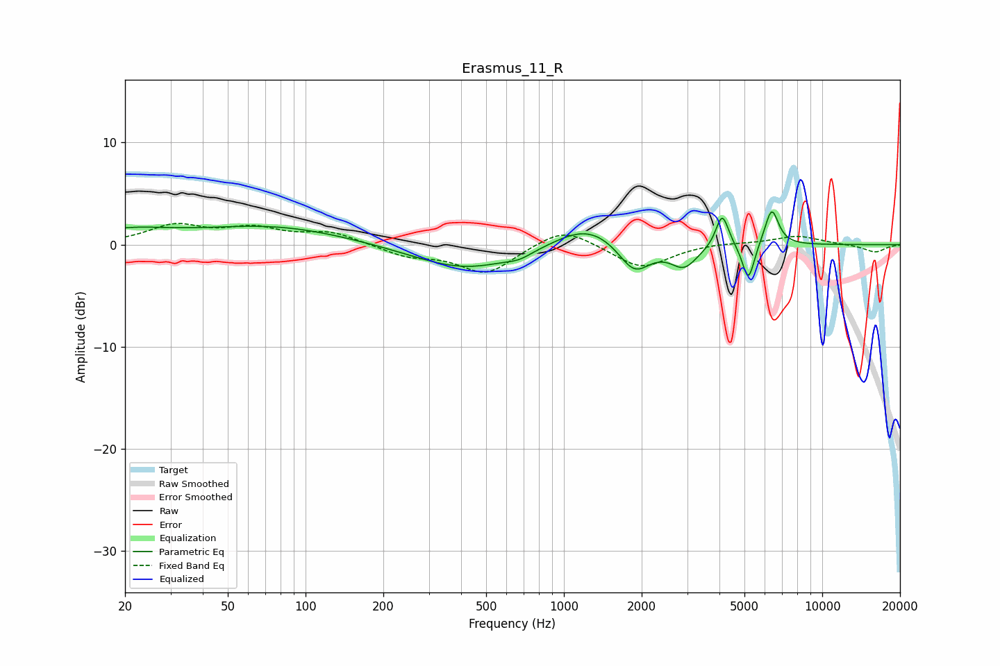

# Erasmus_11_R
See [usage instructions](https://github.com/jaakkopasanen/AutoEq#usage) for more options and info.

### Parametric EQs
Apply preamp of -3.3 dB when using parametric equalizer.

|   # | Type    |   Fc (Hz) |    Q |   Gain (dB) |
|-----|---------|-----------|------|-------------|
|   1 | Peaking |        20 | 0.84 |         1.2 |
|   2 | Peaking |        74 | 0.49 |         1.8 |
|   3 | Peaking |       418 | 0.69 |        -2.5 |
|   4 | Peaking |       672 | 2.93 |        -0.5 |
|   5 | Peaking |      1234 | 1.1  |         2.3 |
|   6 | Peaking |      1873 | 2.28 |        -3   |
|   7 | Peaking |      2918 | 2.69 |        -2.1 |
|   8 | Peaking |      4101 | 5.7  |         3.3 |
|   9 | Peaking |      5177 | 6    |        -3.7 |
|  10 | Peaking |      6374 | 5.2  |         3.6 |

### Fixed Band EQs
When using fixed band (also called graphic) equalizer, apply preamp of **-2.2 dB** (if available) and set gains manually with these parameters.

|   # | Type    |   Fc (Hz) |    Q |   Gain (dB) |
|-----|---------|-----------|------|-------------|
|   1 | Peaking |        31 | 1.41 |         1.8 |
|   2 | Peaking |        62 | 1.41 |         1.4 |
|   3 | Peaking |       125 | 1.41 |         1.2 |
|   4 | Peaking |       250 | 1.41 |        -1   |
|   5 | Peaking |       500 | 1.41 |        -2.8 |
|   6 | Peaking |      1000 | 1.41 |         1.9 |
|   7 | Peaking |      2000 | 1.41 |        -2.3 |
|   8 | Peaking |      4000 | 1.41 |         0.2 |
|   9 | Peaking |      8000 | 1.41 |         0.9 |
|  10 | Peaking |     16000 | 1.41 |        -0.8 |

### Graphs

