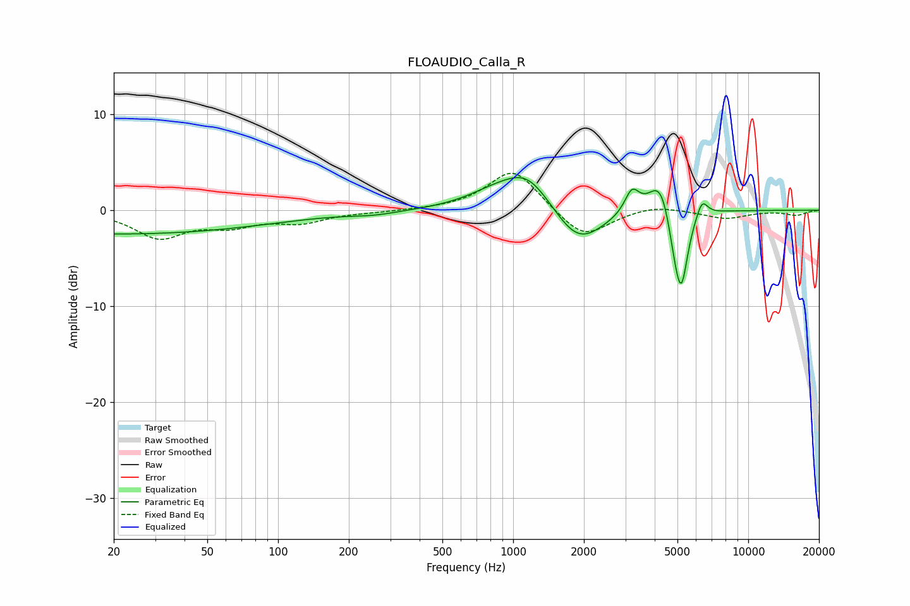

# FLOAUDIO_Calla_R
See [usage instructions](https://github.com/jaakkopasanen/AutoEq#usage) for more options and info.

### Parametric EQs
Apply preamp of -3.5 dB when using parametric equalizer.

|   # | Type    |   Fc (Hz) |    Q |   Gain (dB) |
|-----|---------|-----------|------|-------------|
|   1 | Peaking |        20 | 0.2  |        -2.5 |
|   2 | Peaking |       256 | 1.38 |        -0.3 |
|   3 | Peaking |       828 | 1.14 |         1.4 |
|   4 | Peaking |      1154 | 1.35 |         3.7 |
|   5 | Peaking |      1893 | 1.32 |        -4   |
|   6 | Peaking |      3203 | 4.61 |         2.4 |
|   7 | Peaking |      4243 | 2.8  |         3.9 |
|   8 | Peaking |      4856 | 4.87 |        -2.8 |
|   9 | Peaking |      5199 | 4.91 |        -7.5 |
|  10 | Peaking |      6361 | 5.87 |         1.8 |

### Fixed Band EQs
When using fixed band (also called graphic) equalizer, apply preamp of **-3.9 dB** (if available) and set gains manually with these parameters.

|   # | Type    |   Fc (Hz) |    Q |   Gain (dB) |
|-----|---------|-----------|------|-------------|
|   1 | Peaking |        31 | 1.41 |        -2.7 |
|   2 | Peaking |        62 | 1.41 |        -1.4 |
|   3 | Peaking |       125 | 1.41 |        -1.1 |
|   4 | Peaking |       250 | 1.41 |        -0.2 |
|   5 | Peaking |       500 | 1.41 |         0   |
|   6 | Peaking |      1000 | 1.41 |         4.4 |
|   7 | Peaking |      2000 | 1.41 |        -3.1 |
|   8 | Peaking |      4000 | 1.41 |         0.6 |
|   9 | Peaking |      8000 | 1.41 |        -0.9 |
|  10 | Peaking |     16000 | 1.41 |        -0.5 |

### Graphs

