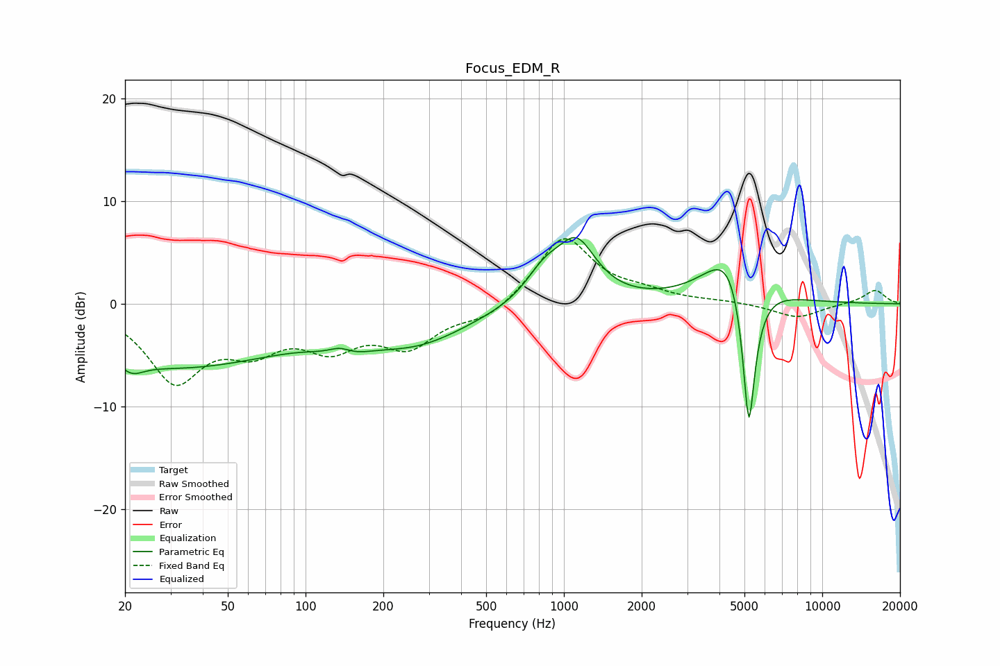

# Focus_EDM_R
See [usage instructions](https://github.com/jaakkopasanen/AutoEq#usage) for more options and info.

### Parametric EQs
Apply preamp of -6.5 dB when using parametric equalizer.

|   # | Type    |   Fc (Hz) |    Q |   Gain (dB) |
|-----|---------|-----------|------|-------------|
|   1 | Peaking |        21 | 2.95 |        -1.4 |
|   2 | Peaking |        25 | 0.49 |        -4.3 |
|   3 | Peaking |        62 | 0.47 |        -2.8 |
|   4 | Peaking |       137 | 2.47 |         3.2 |
|   5 | Peaking |       138 | 1.95 |        -3.7 |
|   6 | Peaking |       269 | 0.69 |        -3.4 |
|   7 | Peaking |       838 | 1.95 |         2.7 |
|   8 | Peaking |      1122 | 1.85 |         5.6 |
|   9 | Peaking |      4496 | 1.45 |         6.5 |
|  10 | Peaking |      5198 | 4.98 |       -16.5 |

### Fixed Band EQs
When using fixed band (also called graphic) equalizer, apply preamp of **-6.4 dB** (if available) and set gains manually with these parameters.

|   # | Type    |   Fc (Hz) |    Q |   Gain (dB) |
|-----|---------|-----------|------|-------------|
|   1 | Peaking |        31 | 1.41 |        -7.1 |
|   2 | Peaking |        62 | 1.41 |        -3.5 |
|   3 | Peaking |       125 | 1.41 |        -3.6 |
|   4 | Peaking |       250 | 1.41 |        -3.8 |
|   5 | Peaking |       500 | 1.41 |        -1.5 |
|   6 | Peaking |      1000 | 1.41 |         6.6 |
|   7 | Peaking |      2000 | 1.41 |         0.8 |
|   8 | Peaking |      4000 | 1.41 |         0.2 |
|   9 | Peaking |      8000 | 1.41 |        -1.4 |
|  10 | Peaking |     16000 | 1.41 |         1.4 |

### Graphs

