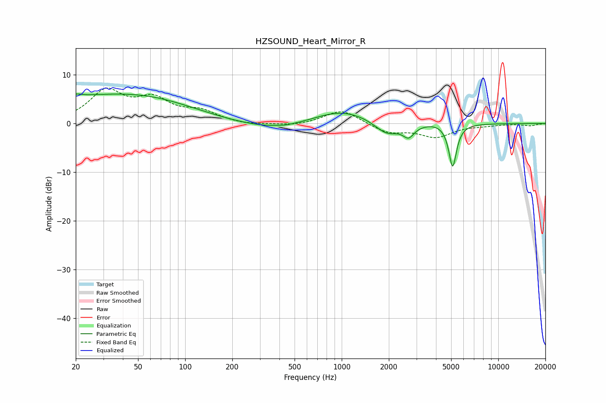

# HZSOUND_Heart_Mirror_R
See [usage instructions](https://github.com/jaakkopasanen/AutoEq#usage) for more options and info.

### Parametric EQs
Apply preamp of -6.2 dB when using parametric equalizer.

|   # | Type    |   Fc (Hz) |    Q |   Gain (dB) |
|-----|---------|-----------|------|-------------|
|   1 | Peaking |        20 | 5.1  |         0.4 |
|   2 | Peaking |        20 | 0.22 |         5   |
|   3 | Peaking |        64 | 0.48 |         1.9 |
|   4 | Peaking |       391 | 0.61 |        -1.7 |
|   5 | Peaking |       444 | 5.95 |        -0.1 |
|   6 | Peaking |       989 | 0.73 |         3.1 |
|   7 | Peaking |      1942 | 1.77 |        -2.9 |
|   8 | Peaking |      2676 | 3.96 |        -2.4 |
|   9 | Peaking |      4052 | 2.21 |         0.3 |
|  10 | Peaking |      5112 | 5.7  |        -8.9 |

### Fixed Band EQs
When using fixed band (also called graphic) equalizer, apply preamp of **-7.4 dB** (if available) and set gains manually with these parameters.

|   # | Type    |   Fc (Hz) |    Q |   Gain (dB) |
|-----|---------|-----------|------|-------------|
|   1 | Peaking |        31 | 1.41 |         6.4 |
|   2 | Peaking |        62 | 1.41 |         4.3 |
|   3 | Peaking |       125 | 1.41 |         2.2 |
|   4 | Peaking |       250 | 1.41 |        -0.4 |
|   5 | Peaking |       500 | 1.41 |        -0.5 |
|   6 | Peaking |      1000 | 1.41 |         2.9 |
|   7 | Peaking |      2000 | 1.41 |        -1.9 |
|   8 | Peaking |      4000 | 1.41 |        -2.6 |
|   9 | Peaking |      8000 | 1.41 |        -0.3 |
|  10 | Peaking |     16000 | 1.41 |        -0.4 |

### Graphs

