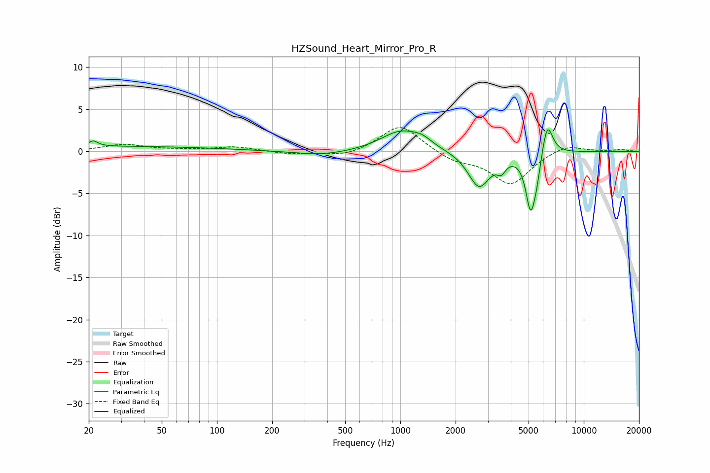

# HZSound_Heart_Mirror_Pro_R
See [usage instructions](https://github.com/jaakkopasanen/AutoEq#usage) for more options and info.

### Parametric EQs
Apply preamp of -2.7 dB when using parametric equalizer.

|   # | Type    |   Fc (Hz) |    Q |   Gain (dB) |
|-----|---------|-----------|------|-------------|
|   1 | Peaking |        21 | 5.9  |         0.6 |
|   2 | Peaking |        22 | 0.18 |         0.6 |
|   3 | Peaking |       376 | 0.95 |        -0.6 |
|   4 | Peaking |      1008 | 1.29 |         2.4 |
|   5 | Peaking |      1317 | 2.73 |         0.7 |
|   6 | Peaking |      2686 | 2.39 |        -4.3 |
|   7 | Peaking |      3553 | 6    |        -1.2 |
|   8 | Peaking |      5129 | 5.17 |        -6.5 |
|   9 | Peaking |      5546 | 6    |        -2   |
|  10 | Peaking |      6321 | 4.64 |         4.1 |

### Fixed Band EQs
When using fixed band (also called graphic) equalizer, apply preamp of **-2.9 dB** (if available) and set gains manually with these parameters.

|   # | Type    |   Fc (Hz) |    Q |   Gain (dB) |
|-----|---------|-----------|------|-------------|
|   1 | Peaking |        31 | 1.41 |         0.8 |
|   2 | Peaking |        62 | 1.41 |         0.1 |
|   3 | Peaking |       125 | 1.41 |         0.5 |
|   4 | Peaking |       250 | 1.41 |        -0.3 |
|   5 | Peaking |       500 | 1.41 |        -0.7 |
|   6 | Peaking |      1000 | 1.41 |         3.3 |
|   7 | Peaking |      2000 | 1.41 |        -1.1 |
|   8 | Peaking |      4000 | 1.41 |        -3.9 |
|   9 | Peaking |      8000 | 1.41 |         0.9 |
|  10 | Peaking |     16000 | 1.41 |         0.2 |

### Graphs

