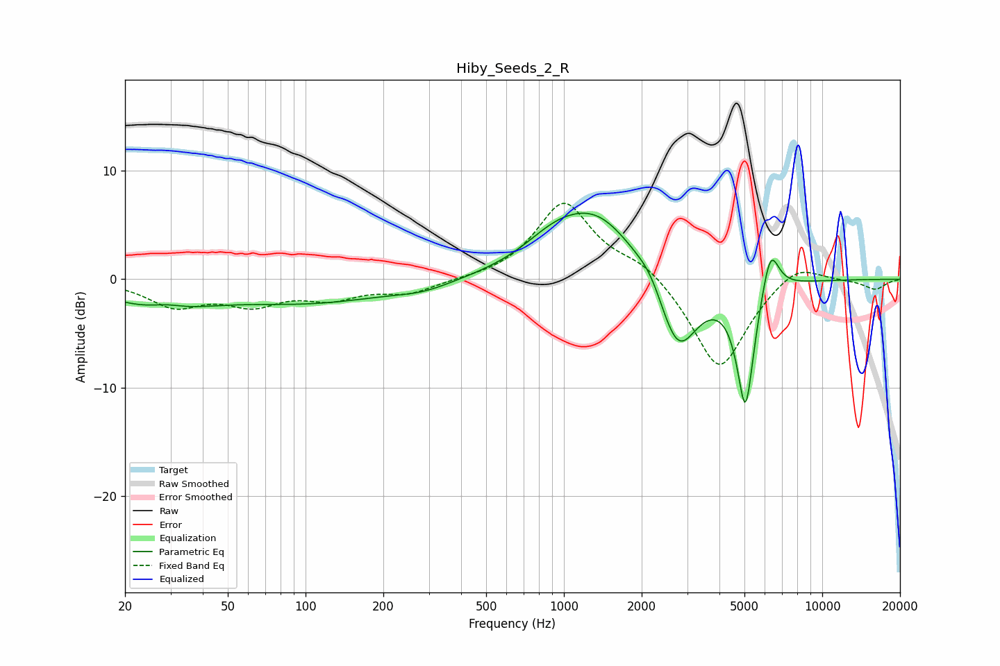

# Hiby_Seeds_2_R
See [usage instructions](https://github.com/jaakkopasanen/AutoEq#usage) for more options and info.

### Parametric EQs
Apply preamp of -6.2 dB when using parametric equalizer.

|   # | Type    |   Fc (Hz) |    Q |   Gain (dB) |
|-----|---------|-----------|------|-------------|
|   1 | Peaking |        27 | 0.7  |        -2.3 |
|   2 | Peaking |        29 | 2.35 |         0.5 |
|   3 | Peaking |       107 | 0.46 |        -2   |
|   4 | Peaking |       286 | 1.25 |        -0.7 |
|   5 | Peaking |       908 | 1.24 |         1.6 |
|   6 | Peaking |      1341 | 0.84 |         6   |
|   7 | Peaking |      2167 | 2.87 |         1.2 |
|   8 | Peaking |      2758 | 1.76 |        -7.8 |
|   9 | Peaking |      5046 | 4.02 |       -11.7 |
|  10 | Peaking |      6295 | 4.09 |         4.5 |

### Fixed Band EQs
When using fixed band (also called graphic) equalizer, apply preamp of **-7.1 dB** (if available) and set gains manually with these parameters.

|   # | Type    |   Fc (Hz) |    Q |   Gain (dB) |
|-----|---------|-----------|------|-------------|
|   1 | Peaking |        31 | 1.41 |        -2.3 |
|   2 | Peaking |        62 | 1.41 |        -2   |
|   3 | Peaking |       125 | 1.41 |        -1.5 |
|   4 | Peaking |       250 | 1.41 |        -1.2 |
|   5 | Peaking |       500 | 1.41 |        -0.1 |
|   6 | Peaking |      1000 | 1.41 |         7.1 |
|   7 | Peaking |      2000 | 1.41 |         1.5 |
|   8 | Peaking |      4000 | 1.41 |        -8.6 |
|   9 | Peaking |      8000 | 1.41 |         1.8 |
|  10 | Peaking |     16000 | 1.41 |        -0.9 |

### Graphs

