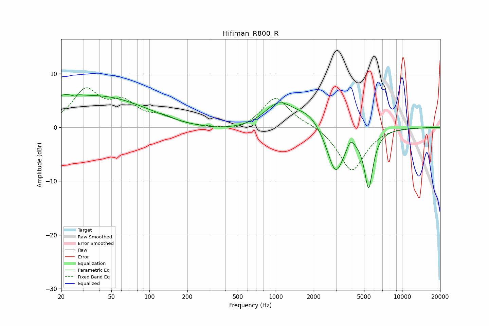

# Hifiman_R800_R
See [usage instructions](https://github.com/jaakkopasanen/AutoEq#usage) for more options and info.

### Parametric EQs
Apply preamp of -6.2 dB when using parametric equalizer.

|   # | Type    |   Fc (Hz) |    Q |   Gain (dB) |
|-----|---------|-----------|------|-------------|
|   1 | Peaking |        20 | 1.48 |         1.9 |
|   2 | Peaking |        26 | 5.98 |        -3.1 |
|   3 | Peaking |        26 | 5.73 |         2.9 |
|   4 | Peaking |        41 | 0.38 |         5.6 |
|   5 | Peaking |       402 | 0.4  |        -0.9 |
|   6 | Peaking |      1057 | 1.21 |         4.6 |
|   7 | Peaking |      1860 | 1.26 |         2.6 |
|   8 | Peaking |      2978 | 2    |        -9   |
|   9 | Peaking |      3909 | 4.78 |         1.8 |
|  10 | Peaking |      5437 | 3.99 |       -10.5 |

### Fixed Band EQs
When using fixed band (also called graphic) equalizer, apply preamp of **-7.5 dB** (if available) and set gains manually with these parameters.

|   # | Type    |   Fc (Hz) |    Q |   Gain (dB) |
|-----|---------|-----------|------|-------------|
|   1 | Peaking |        31 | 1.41 |         6.6 |
|   2 | Peaking |        62 | 1.41 |         3.9 |
|   3 | Peaking |       125 | 1.41 |         1.6 |
|   4 | Peaking |       250 | 1.41 |        -0   |
|   5 | Peaking |       500 | 1.41 |        -0.9 |
|   6 | Peaking |      1000 | 1.41 |         5.7 |
|   7 | Peaking |      2000 | 1.41 |         0.6 |
|   8 | Peaking |      4000 | 1.41 |        -8.2 |
|   9 | Peaking |      8000 | 1.41 |         0.2 |
|  10 | Peaking |     16000 | 1.41 |         0.1 |

### Graphs

