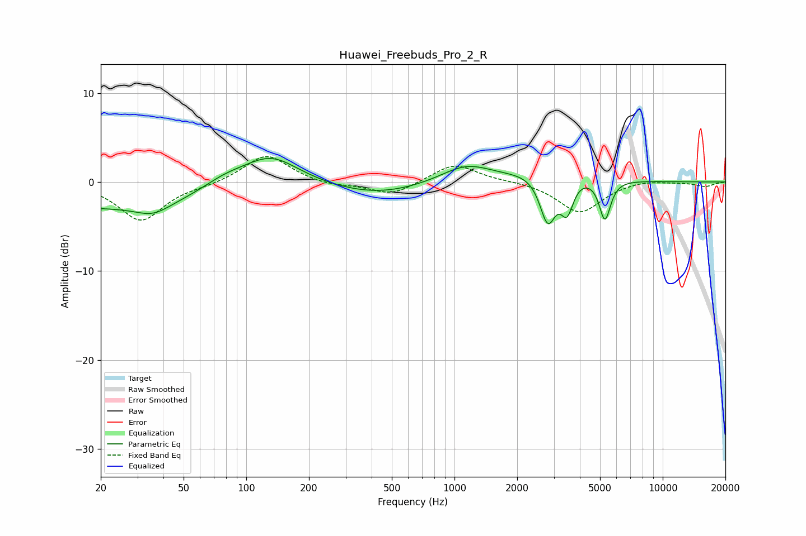

# Huawei_Freebuds_Pro_2_R
See [usage instructions](https://github.com/jaakkopasanen/AutoEq#usage) for more options and info.

### Parametric EQs
Apply preamp of -2.7 dB when using parametric equalizer.

|   # | Type    |   Fc (Hz) |    Q |   Gain (dB) |
|-----|---------|-----------|------|-------------|
|   1 | Peaking |        22 | 0.23 |        -2.9 |
|   2 | Peaking |        36 | 1.72 |        -1.2 |
|   3 | Peaking |        78 | 1.21 |         1.4 |
|   4 | Peaking |       131 | 1.03 |         3.5 |
|   5 | Peaking |       425 | 0.64 |        -1.4 |
|   6 | Peaking |      1138 | 1.16 |         2   |
|   7 | Peaking |      2808 | 3.52 |        -5.9 |
|   8 | Peaking |      3076 | 1    |         2   |
|   9 | Peaking |      3471 | 4.45 |        -4   |
|  10 | Peaking |      5277 | 5.17 |        -4.6 |

### Fixed Band EQs
When using fixed band (also called graphic) equalizer, apply preamp of **-2.9 dB** (if available) and set gains manually with these parameters.

|   # | Type    |   Fc (Hz) |    Q |   Gain (dB) |
|-----|---------|-----------|------|-------------|
|   1 | Peaking |        31 | 1.41 |        -4.3 |
|   2 | Peaking |        62 | 1.41 |        -0.3 |
|   3 | Peaking |       125 | 1.41 |         3.2 |
|   4 | Peaking |       250 | 1.41 |        -0.4 |
|   5 | Peaking |       500 | 1.41 |        -1.5 |
|   6 | Peaking |      1000 | 1.41 |         2.1 |
|   7 | Peaking |      2000 | 1.41 |         0.1 |
|   8 | Peaking |      4000 | 1.41 |        -3.5 |
|   9 | Peaking |      8000 | 1.41 |         0.3 |
|  10 | Peaking |     16000 | 1.41 |        -0.5 |

### Graphs

