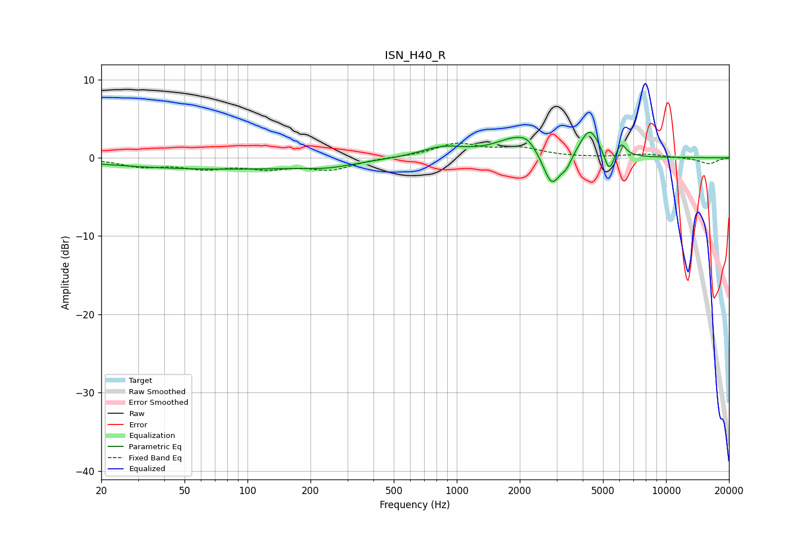

# ISN_H40_R
See [usage instructions](https://github.com/jaakkopasanen/AutoEq#usage) for more options and info.

### Parametric EQs
Apply preamp of -3.3 dB when using parametric equalizer.

|   # | Type    |   Fc (Hz) |    Q |   Gain (dB) |
|-----|---------|-----------|------|-------------|
|   1 | Peaking |        73 | 0.26 |        -1.4 |
|   2 | Peaking |       243 | 1.26 |        -0.5 |
|   3 | Peaking |       856 | 1.29 |         1.3 |
|   4 | Peaking |      1945 | 1.4  |         2.5 |
|   5 | Peaking |      2183 | 3.73 |         0.8 |
|   6 | Peaking |      2844 | 3.37 |        -4.5 |
|   7 | Peaking |      3343 | 5.74 |        -1.2 |
|   8 | Peaking |      4317 | 3.05 |         3.7 |
|   9 | Peaking |      5352 | 5.85 |        -2.8 |
|  10 | Peaking |      6094 | 6    |         1.8 |

### Fixed Band EQs
When using fixed band (also called graphic) equalizer, apply preamp of **-2.0 dB** (if available) and set gains manually with these parameters.

|   # | Type    |   Fc (Hz) |    Q |   Gain (dB) |
|-----|---------|-----------|------|-------------|
|   1 | Peaking |        31 | 1.41 |        -1   |
|   2 | Peaking |        62 | 1.41 |        -1.2 |
|   3 | Peaking |       125 | 1.41 |        -1.1 |
|   4 | Peaking |       250 | 1.41 |        -1.4 |
|   5 | Peaking |       500 | 1.41 |         0   |
|   6 | Peaking |      1000 | 1.41 |         1.7 |
|   7 | Peaking |      2000 | 1.41 |         1.1 |
|   8 | Peaking |      4000 | 1.41 |        -0   |
|   9 | Peaking |      8000 | 1.41 |         0.5 |
|  10 | Peaking |     16000 | 1.41 |        -0.8 |

### Graphs

