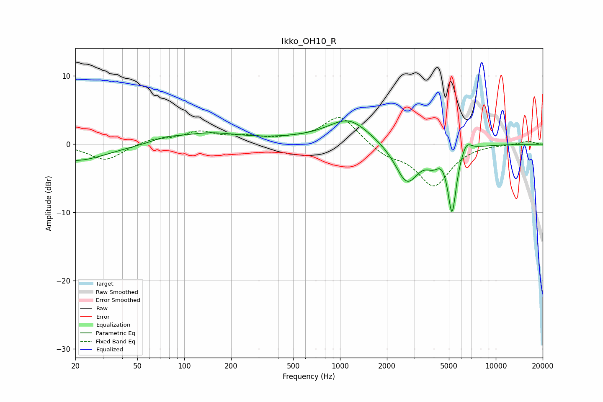

# Ikko_OH10_R
See [usage instructions](https://github.com/jaakkopasanen/AutoEq#usage) for more options and info.

### Parametric EQs
Apply preamp of -3.5 dB when using parametric equalizer.

|   # | Type    |   Fc (Hz) |    Q |   Gain (dB) |
|-----|---------|-----------|------|-------------|
|   1 | Peaking |        20 | 0.71 |        -2.5 |
|   2 | Peaking |        75 | 1.62 |         0.6 |
|   3 | Peaking |       143 | 0.73 |         1.5 |
|   4 | Peaking |       618 | 0.4  |         0.6 |
|   5 | Peaking |      1140 | 1.1  |         3.3 |
|   6 | Peaking |      2688 | 1.86 |        -5.8 |
|   7 | Peaking |      3968 | 3.1  |        -1.7 |
|   8 | Peaking |      4484 | 4.39 |         0.5 |
|   9 | Peaking |      5238 | 5.11 |        -9.5 |
|  10 | Peaking |      6473 | 4.37 |         1.6 |

### Fixed Band EQs
When using fixed band (also called graphic) equalizer, apply preamp of **-4.0 dB** (if available) and set gains manually with these parameters.

|   # | Type    |   Fc (Hz) |    Q |   Gain (dB) |
|-----|---------|-----------|------|-------------|
|   1 | Peaking |        31 | 1.41 |        -2.4 |
|   2 | Peaking |        62 | 1.41 |         0.7 |
|   3 | Peaking |       125 | 1.41 |         1.7 |
|   4 | Peaking |       250 | 1.41 |         0.9 |
|   5 | Peaking |       500 | 1.41 |         0.5 |
|   6 | Peaking |      1000 | 1.41 |         4.2 |
|   7 | Peaking |      2000 | 1.41 |        -1.5 |
|   8 | Peaking |      4000 | 1.41 |        -6   |
|   9 | Peaking |      8000 | 1.41 |         0.1 |
|  10 | Peaking |     16000 | 1.41 |         0.5 |

### Graphs

