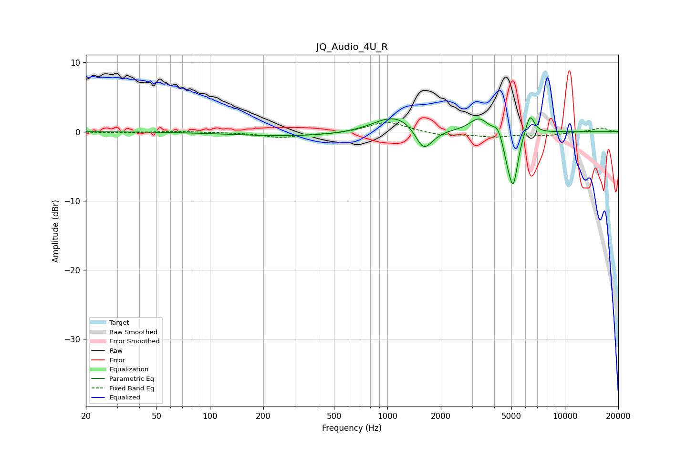

# JQ_Audio_4U_R
See [usage instructions](https://github.com/jaakkopasanen/AutoEq#usage) for more options and info.

### Parametric EQs
Apply preamp of -2.1 dB when using parametric equalizer.

|   # | Type    |   Fc (Hz) |    Q |   Gain (dB) |
|-----|---------|-----------|------|-------------|
|   1 | Peaking |       317 | 0.39 |        -0.7 |
|   2 | Peaking |      1041 | 1.25 |         1.8 |
|   3 | Peaking |      1263 | 1.34 |         1   |
|   4 | Peaking |      1585 | 3.15 |        -2.8 |
|   5 | Peaking |      1718 | 2.47 |        -0.8 |
|   6 | Peaking |      3287 | 2.69 |         2   |
|   7 | Peaking |      4180 | 5.99 |         1.2 |
|   8 | Peaking |      4741 | 6    |        -2   |
|   9 | Peaking |      5124 | 5.36 |        -7.3 |
|  10 | Peaking |      6359 | 5.61 |         3   |

### Fixed Band EQs
When using fixed band (also called graphic) equalizer, apply preamp of **-1.4 dB** (if available) and set gains manually with these parameters.

|   # | Type    |   Fc (Hz) |    Q |   Gain (dB) |
|-----|---------|-----------|------|-------------|
|   1 | Peaking |        31 | 1.41 |        -0.2 |
|   2 | Peaking |        62 | 1.41 |         0.1 |
|   3 | Peaking |       125 | 1.41 |        -0.1 |
|   4 | Peaking |       250 | 1.41 |        -0.8 |
|   5 | Peaking |       500 | 1.41 |        -0.3 |
|   6 | Peaking |      1000 | 1.41 |         1.5 |
|   7 | Peaking |      2000 | 1.41 |        -0.5 |
|   8 | Peaking |      4000 | 1.41 |        -0.7 |
|   9 | Peaking |      8000 | 1.41 |        -0.5 |
|  10 | Peaking |     16000 | 1.41 |         0.5 |

### Graphs

