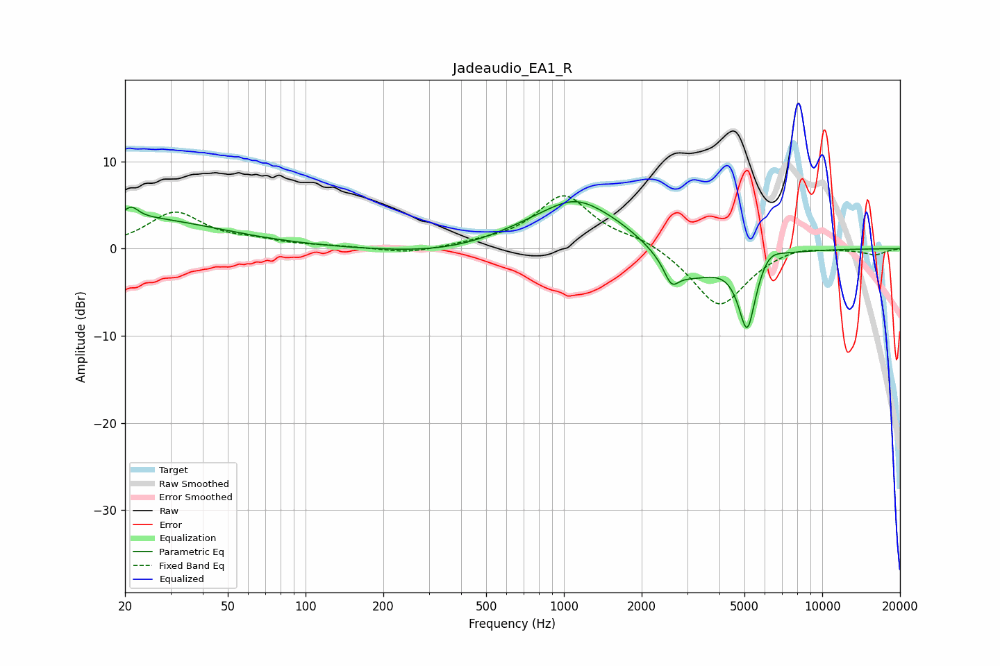

# Jadeaudio_EA1_R
See [usage instructions](https://github.com/jaakkopasanen/AutoEq#usage) for more options and info.

### Parametric EQs
Apply preamp of -5.5 dB when using parametric equalizer.

|   # | Type    |   Fc (Hz) |    Q |   Gain (dB) |
|-----|---------|-----------|------|-------------|
|   1 | Peaking |        20 | 0.4  |         3.6 |
|   2 | Peaking |        21 | 5.43 |         1.2 |
|   3 | Peaking |       385 | 0.56 |        -1.1 |
|   4 | Peaking |      1103 | 1.56 |         1.2 |
|   5 | Peaking |      1147 | 0.58 |         5.2 |
|   6 | Peaking |      2607 | 5.28 |        -2.1 |
|   7 | Peaking |      2969 | 1.11 |        -4.4 |
|   8 | Peaking |      5134 | 3.99 |        -9.1 |
|   9 | Peaking |      5360 | 5.22 |         0.4 |
|  10 | Peaking |      6172 | 2.86 |         1.5 |

### Fixed Band EQs
When using fixed band (also called graphic) equalizer, apply preamp of **-6.2 dB** (if available) and set gains manually with these parameters.

|   # | Type    |   Fc (Hz) |    Q |   Gain (dB) |
|-----|---------|-----------|------|-------------|
|   1 | Peaking |        31 | 1.41 |         4.1 |
|   2 | Peaking |        62 | 1.41 |         0.7 |
|   3 | Peaking |       125 | 1.41 |         0.2 |
|   4 | Peaking |       250 | 1.41 |        -0.6 |
|   5 | Peaking |       500 | 1.41 |         0.4 |
|   6 | Peaking |      1000 | 1.41 |         6   |
|   7 | Peaking |      2000 | 1.41 |         1   |
|   8 | Peaking |      4000 | 1.41 |        -6.8 |
|   9 | Peaking |      8000 | 1.41 |         0.6 |
|  10 | Peaking |     16000 | 1.41 |        -0.7 |

### Graphs

