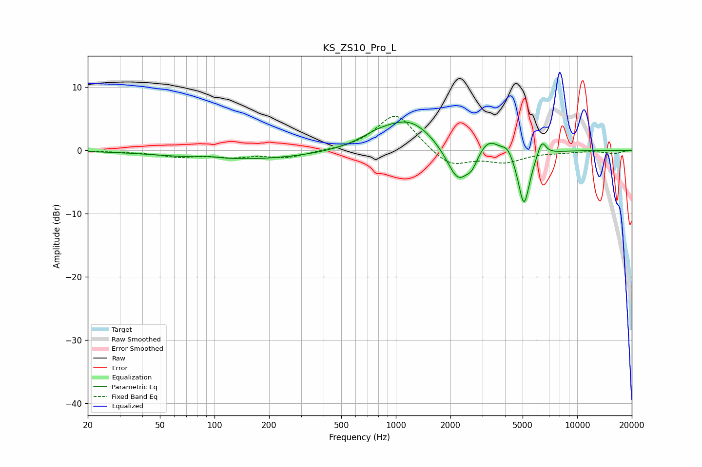

# KS_ZS10_Pro_L
See [usage instructions](https://github.com/jaakkopasanen/AutoEq#usage) for more options and info.

### Parametric EQs
Apply preamp of -4.6 dB when using parametric equalizer.

|   # | Type    |   Fc (Hz) |    Q |   Gain (dB) |
|-----|---------|-----------|------|-------------|
|   1 | Peaking |        94 | 2.21 |         0.3 |
|   2 | Peaking |       146 | 0.36 |        -1.5 |
|   3 | Peaking |       788 | 1.43 |         1.2 |
|   4 | Peaking |      1197 | 0.99 |         4.7 |
|   5 | Peaking |      2205 | 2.19 |        -6   |
|   6 | Peaking |      2631 | 4.9  |        -1.5 |
|   7 | Peaking |      3246 | 2.63 |         2.3 |
|   8 | Peaking |      4135 | 4.45 |         1.4 |
|   9 | Peaking |      5086 | 4.26 |        -8.9 |
|  10 | Peaking |      6372 | 5.84 |         2.5 |

### Fixed Band EQs
When using fixed band (also called graphic) equalizer, apply preamp of **-5.5 dB** (if available) and set gains manually with these parameters.

|   # | Type    |   Fc (Hz) |    Q |   Gain (dB) |
|-----|---------|-----------|------|-------------|
|   1 | Peaking |        31 | 1.41 |        -0.1 |
|   2 | Peaking |        62 | 1.41 |        -0.9 |
|   3 | Peaking |       125 | 1.41 |        -0.9 |
|   4 | Peaking |       250 | 1.41 |        -1.1 |
|   5 | Peaking |       500 | 1.41 |        -0.1 |
|   6 | Peaking |      1000 | 1.41 |         6   |
|   7 | Peaking |      2000 | 1.41 |        -2.7 |
|   8 | Peaking |      4000 | 1.41 |        -1.7 |
|   9 | Peaking |      8000 | 1.41 |        -0.2 |
|  10 | Peaking |     16000 | 1.41 |        -0.5 |

### Graphs

