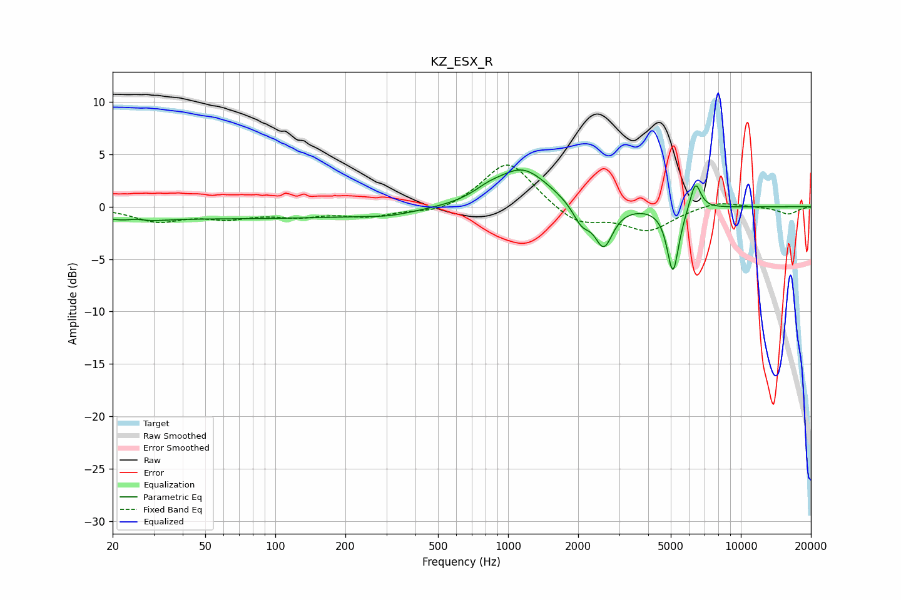

# KZ_ESX_R
See [usage instructions](https://github.com/jaakkopasanen/AutoEq#usage) for more options and info.

### Parametric EQs
Apply preamp of -3.6 dB when using parametric equalizer.

|   # | Type    |   Fc (Hz) |    Q |   Gain (dB) |
|-----|---------|-----------|------|-------------|
|   1 | Peaking |        25 | 1.75 |        -1   |
|   2 | Peaking |        25 | 2.88 |         0.7 |
|   3 | Peaking |        73 | 0.18 |        -1.1 |
|   4 | Peaking |       308 | 1.43 |        -0.3 |
|   5 | Peaking |       819 | 2.28 |         0.6 |
|   6 | Peaking |      1154 | 1.25 |         3.6 |
|   7 | Peaking |      2070 | 3.66 |        -1.8 |
|   8 | Peaking |      2578 | 3.65 |        -3.8 |
|   9 | Peaking |      5111 | 5.52 |        -6.3 |
|  10 | Peaking |      6380 | 5.87 |         2.8 |

### Fixed Band EQs
When using fixed band (also called graphic) equalizer, apply preamp of **-4.1 dB** (if available) and set gains manually with these parameters.

|   # | Type    |   Fc (Hz) |    Q |   Gain (dB) |
|-----|---------|-----------|------|-------------|
|   1 | Peaking |        31 | 1.41 |        -1.3 |
|   2 | Peaking |        62 | 1.41 |        -0.9 |
|   3 | Peaking |       125 | 1.41 |        -0.8 |
|   4 | Peaking |       250 | 1.41 |        -0.8 |
|   5 | Peaking |       500 | 1.41 |        -0.7 |
|   6 | Peaking |      1000 | 1.41 |         4.5 |
|   7 | Peaking |      2000 | 1.41 |        -1.8 |
|   8 | Peaking |      4000 | 1.41 |        -2.2 |
|   9 | Peaking |      8000 | 1.41 |         0.6 |
|  10 | Peaking |     16000 | 1.41 |        -0.7 |

### Graphs

