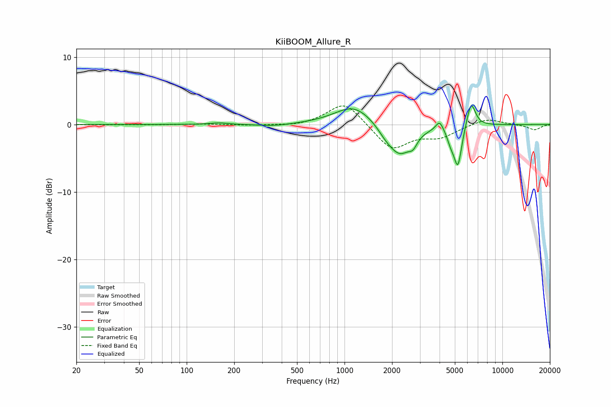

# KiiBOOM_Allure_R
See [usage instructions](https://github.com/jaakkopasanen/AutoEq#usage) for more options and info.

### Parametric EQs
Apply preamp of -2.9 dB when using parametric equalizer.

|   # | Type    |   Fc (Hz) |    Q |   Gain (dB) |
|-----|---------|-----------|------|-------------|
|   1 | Peaking |       160 | 2.55 |         0.2 |
|   2 | Peaking |       358 | 1.34 |        -0.3 |
|   3 | Peaking |      1147 | 1.17 |         2.9 |
|   4 | Peaking |      1812 | 2.89 |        -0.9 |
|   5 | Peaking |      2234 | 1.87 |        -4.5 |
|   6 | Peaking |      2715 | 5.4  |        -1.2 |
|   7 | Peaking |      4002 | 6    |         1.5 |
|   8 | Peaking |      4710 | 5.96 |        -1.5 |
|   9 | Peaking |      5223 | 5.48 |        -6   |
|  10 | Peaking |      6331 | 4.95 |         3.9 |

### Fixed Band EQs
When using fixed band (also called graphic) equalizer, apply preamp of **-2.8 dB** (if available) and set gains manually with these parameters.

|   # | Type    |   Fc (Hz) |    Q |   Gain (dB) |
|-----|---------|-----------|------|-------------|
|   1 | Peaking |        31 | 1.41 |        -0   |
|   2 | Peaking |        62 | 1.41 |        -0   |
|   3 | Peaking |       125 | 1.41 |         0.1 |
|   4 | Peaking |       250 | 1.41 |        -0.1 |
|   5 | Peaking |       500 | 1.41 |        -0.3 |
|   6 | Peaking |      1000 | 1.41 |         3.5 |
|   7 | Peaking |      2000 | 1.41 |        -3.8 |
|   8 | Peaking |      4000 | 1.41 |        -1.7 |
|   9 | Peaking |      8000 | 1.41 |         1   |
|  10 | Peaking |     16000 | 1.41 |        -0.8 |

### Graphs

